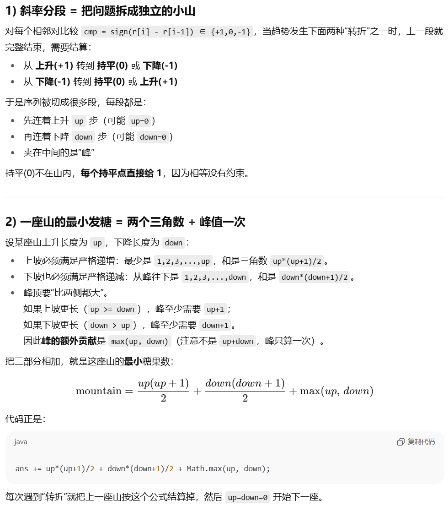

题目简述：

> `n` 个孩子站成一排。给你一个整数数组 `ratings` 表示每个孩子的评分。
>
> 你需要按照以下要求，给这些孩子分发糖果：
>
> - 每个孩子至少分配到 `1` 个糖果。
> - 相邻两个孩子中，评分更高的那个会获得更多的糖果。
>
> 请你给每个孩子分发糖果，计算并返回需要准备的 **最少糖果数目** 。

题目链接：[135. 分发糖果](https://leetcode.cn/problems/candy/)

# 前言

这里实际上针对原问题提供了五种解决方案，其中 O(1) 空间开销的参考解法不是由我实现的，而是由 GPT-5 Thinking 给出的。剩余几种算法均由我实现。

***利用鞍点处的不变式***的算法是我自己首先想出来的，但最容易理解也最容易编程的算法是***记忆化搜索（递归）***，而***贪心算法***虽然代码也很简洁，但每次选择局部最优解最终能够得到全局最优解的正确性却需要进一步的严谨证明。

综合而论，<u>最推荐***记忆化搜索（递归）***的实现</u>，而且这也是<u>最容易修改以适应循环数组情况的实现</u>。

# 模拟（性能最差）

## 思路

这是效率极低的方案，但是在题目给定的数据范围下勉强能够 AC。

仅作为思路启发，该算法性能比较差，不应采用：维护一个当前对每个孩子给定糖果数量的数组 `candy`，进行一次 `ratings` 的遍历，对于 `ratings[i]`：

- 如果成立 `ratings[i] > ratings[i-1]`，此时 `ratings[i]` 右侧的信息暂时未知，我们当作 `ratings[i]` 系末位元素处理，于是按照定义有 `candy[i] = candy[i-1] + 1`；
- 如果成立 `ratings[i] == ratings[i-1]`，同样地，由于此时 `ratings[i]` 右侧的信息暂时未知，我们当作 `ratings[i]` 系末位元素处理，于是按照定义有 `candy[i] = 1`；
- 如果成立 `ratings[i] < ratings[i-1]`，依然视 `ratings[i]` 为末位元素，因此 `candy[i] = 1`，并且令 `j = i`（临时变量），
  1. `candy[j-1]` 可能需要被更新，至少应为 `candy[j] + 1`，但可能 `candy[j-1]` 本就大于等于 `candy[j] + 1`，这种情况下应维持 `candy[j-1]` 不变，因此 `candy[j-1] = max(candy[j-1], candy[j] + 1)`；
  2. 继续检查是否成立 `ratings[j-1] < ratings[j-2]`，如果成立，则 `ratings[j-1]` 的更新会导致 `ratings[j-2]` 可能也需要被更新，因此 `j--`，然后回到第一步，直到 `j` 指针越界或某次成立 `ratings[j-1] >= ratings[j-2]`。

## 代码

算法的时间复杂度为 $O(n^2)$，空间复杂度为 $O(n)$，勉强还能 AC。

```java
class Solution {
    public int candy(int[] ratings) {
        int[] candy = new int[ratings.length];
        candy[0] = 1;

        for (int i = 1; i < ratings.length; i++) {
            if (ratings[i] > ratings[i - 1]) {
                candy[i] = candy[i - 1] + 1;
            } else if (ratings[i] == ratings[i - 1]) {
                candy[i] = 1;
            } else {
                candy[i] = 1;
                if (candy[i - 1] == 1) {
                    int j = i - 1;
                    while (j >= 0 && ratings[j] > ratings[j + 1]) {
                        candy[j] = Math.max(candy[j + 1] + 1, candy[j]);
                        j--;
                    }
                }
            }
        }

        int sum = 0;
        for (int num : candy) sum += num;
        return sum;
    }
}
```

# 利用鞍点处的不变式

模拟的算法与利用鞍点不变式的算法都是我自己想出来的算法，其他的算法思路是从别人的分析中学习到的。

## 思路

观察模拟的思路，发现只需要在鞍点（即一点上的元素同时小于等于其左右元素）结算糖果就可以找出所有支出糖果为 1 的点。这是因为反证法不难证明，无论在山峰我们需要支出多少个糖果，在鞍点的需要支出的糖果数必然为 1；如果在某点需要支出的糖果数为 1，则该点必然为鞍点。也就是说，鞍点的充要条件是此处应发 1 个糖果。这是相当重要的规律与不变式。

不难知道两个相邻的鞍点间至多存在唯一的一个山峰，即两个鞍点要么紧贴着，要么自最左侧的鞍点起元素值首先单调递增，到达山峰后再单调递减。因此，我们可以在第一趟扫描时找出所有的鞍点，然后在第二趟扫描时自每个鞍点向右侧出发，鞍点右侧的孩子能获得的糖果数随指针移动的步数而增加，直到我们到达山峰——山峰处孩子能获得的糖果数暂不处理，而是先从下一个鞍点的左侧出发，下一个鞍点左侧的孩子能获得的糖果数随指针移动的步数而增加，直到我们再次到达山峰。此时，山峰的糖果数恰为两个指针所移动步数的最大值。

该方案能进一步优化，即每找到一个鞍点就向右侧递增指针，到达山峰后再找到下一个鞍点，找到下一个鞍点后首先向左侧递增以结算上一个鞍点下一个鞍点间孩子能获得的糖果数。这样便不再需要额外的辅助数组记录所有鞍点，但逻辑复杂度较高，容易出错。

## 代码

算法的时间复杂度为 $O(n)$，空间复杂度为 $O(n)$。

可以不使用辅助数组、每搜索到一对鞍点时直接结算糖果计数，这样的话空间复杂度为 $O(1)$，但代码会繁复不少。

```java
class Solution {
    public int candy(int[] ratings) {
        int n = ratings.length;
        // 保证 ratings 至少包含两个元素
        if (n <= 1) return n;
        int[] saddles = new int[n];  // 鞍点数组，不想用 ArrayList 是因为我很讨厌 Java 对 int 的封装
        int candy;
        int len = 0;

        // 找出所有鞍点
        if (ratings[0] <= ratings[1]) saddles[len++] = 0;
        for (int i = 1; i < n - 1; i++) {
            if (ratings[i] <= ratings[i - 1] && ratings[i] <= ratings[i + 1]) saddles[len++] = i;
        }
        if (ratings[n - 1] <= ratings[n - 2]) saddles[len++] = n - 1;

        candy = len;

        /* 两个鞍点之间至多存在两个最大值，且两个最大值必然相邻 */
        for (int k = 0; k < len - 1; k++) {
            int i = saddles[k] + 1;
            int j = saddles[k + 1] - 1;

            // 跳过紧邻鞍点对
            if (i > j) continue;

            int maxValue = ratings[i];
            for (int m = i; m <= j; m++) maxValue = Math.max(maxValue, ratings[m]);

            int candy_i = 1;
            while (ratings[i] < maxValue) {
                if (ratings[i] > ratings[i - 1]) candy_i++;
                candy += candy_i;
                i++;
            }

            int candy_j = 1;
            while (ratings[j] < maxValue) {
                if (ratings[j] > ratings[j + 1]) candy_j++;
                candy += candy_j;
                j--;
            }

            // 仅一个最大值
            if (i == j) candy += Math.max(candy_i, candy_j) + 1;
            // 存在两个最大值
            else candy += candy_i + candy_j + 2;
        }

        // 单独结算首尾鞍点
        int candy_i = 1;
        for (int i = saddles[0] - 1; i >= 0; i--) {
            if (ratings[i] > ratings[i + 1]) candy_i++;
            candy += candy_i;
        }
        candy_i = 1;
        for (int i = saddles[len - 1] + 1; i < n; i++) {
            if (ratings[i] > ratings[i - 1]) candy_i++;
            candy += candy_i;
        }

        return candy;
    }
}
```

# 记忆化搜索（递归）

## 思路

递归地更新 `candy`，对于 `dfs(i)`，设计返回值为 `ratings[i]` 对应孩子能够获得的糖果数：

1. 如果 `candy[i]` 的值已缓存（即值不为初始化的 `0`），则直接返回 `candy[i]`；
2. 否则，暂时令 `candy[i] = 1` 表示考虑 `ratings[i]` 为鞍点的情形，作为子递归调用的基准条件；
3. 如果 `ratings[i] > ratings[i - 1]`，根据要求，令 `candy[i] = max(candy[i], dfs(i - 1))`；
4. 如果 `ratings[i] > ratings[i + 1]`，根据要求，令 `candy[i] = max(candy[i], dfs(i + 1))`；
5. 返回 `candy[i]`。

这样，对于每个孩子，我们都确保了：

- *每个孩子至少分配到 1 个糖果*；
- *相邻两个孩子中，评分更高的孩子会获得更多的糖果*。

## 代码

算法的时间复杂度为 $O(n)$，空间复杂度为 $O(n)$。

```java
class Solution {

    private int[] ratings;
    private int[] candy;
    private int n;

    public int candy(int[] ratings) {
        this.ratings = ratings;
        n = ratings.length;
        candy = new int[n];

        int res = 0;
        for (int i = 0; i < n; i++) res += dfs(i);
        return res;
    }

    private int dfs(int i) {
        if (i < 0 || i >= n) return 0;
        if (candy[i] != 0) return candy[i];

        candy[i] = 1;
        if (extendRatings(i) > extendRatings(i - 1)) candy[i] = dfs(i - 1) + 1;
        if (extendRatings(i) > extendRatings(i + 1)) candy[i] = Math.max(candy[i], dfs(i + 1) + 1);
        return candy[i];
    }

    private int extendRatings(int i) {
        if (i == -1 || i == n) return Integer.MAX_VALUE;
        return ratings[i];
    }
}
```

# 贪心算法

## 思路

或许能够从模拟的思路中得到一点灵感：

- 在模拟的代码中，可以看到当 `ratings[i] >= ratings[i - 1]` 时处理是十分简洁的，并且此时不会发生回扫；
- 当 `ratings[i] < ratings[i - 1]` 时就麻烦了，此时需要回扫更新糖果数量数组。

贪心算法中进行两遍扫描：

1. 正向扫描时只考虑 `ratings[i] > ratings[i - 1]` 的处理，若 `ratings[i] <= ratings[i - 1]` 则更新 `candy_1[i] = 1`，但不回扫并回头更新糖果数量数组；
2. 反向扫描时只考虑 `ratings[i] > ratings[i + 1]` 的处理，若 `ratings[i] <= ratings[i + 1]` 则更新 `candy_2[i] = 1`，但不回扫并回头更新糖果数量数组。

最后，对 `candy_1[i]` 与 `candy_2[i]` 取二者最大值，结果即为最终需要支出的糖果数量数组。

> *正向扫描（处理「左边约束」）和反向扫描（处理「右边约束」）时，我们每次都只加到最小能满足的数，绝不多给。最后取 max，是在「保证左右都合法」的前提下——即同时考虑左右约束，每个位置给到的也是最小值，而且是合法的最小值。*

可以理解为一共存在两种相互独立的约束，正向扫描与反向扫描每次都考虑其中一种约束，最终再综合两次遍历的结果就可以同时考虑到两种约束。

## 代码

算法的时间复杂度为 $O(n)$，空间复杂度为 $O(n)$。

```java
class Solution {
    public int candy(int[] ratings) {
        int n = ratings.length;
        int[] candy_1 = new int[n];
        int[] candy_2 = new int[n];
        
        int candy = 1;
        candy_1[0] = 1;
        for (int i = 1; i < n; i++) {
            if (ratings[i] > ratings[i - 1]) {
                candy++;
            } else {
                candy = 1;
            }
            candy_1[i] = candy;
        }

        candy = 1;
        candy_2[n - 1] = 1;
        for (int i = n - 2; i >= 0; i--) {
            if (ratings[i] > ratings[i + 1]) {
                candy++;
            } else {
                candy = 1;
            }
            candy_2[i] = candy;
        }

        int candies = 0;
        for (int i = 0; i < n; i++) {
            candies += Math.max(candy_1[i], candy_2[i]);
        }

        return candies;
    }
}
```

# O(1) 空间开销参考解法

仅供参考，该算法是 GPT-5 Thinking 给出的，而不是由我实现的。

对此，GPT-5 Thinking 是这样解释的：



## 代码

算法的时间复杂度为 $O(n)$，空间复杂度为 $O(1)$。

```java
/* 这份代码是 GPT-5 Thinking 给出的，而不是由我实现的 */

class Solution {
    public int candy(int[] ratings) {
        int n = ratings.length;
        if (n <= 1) return n;

        long ans = 1;          // 先给第一个 1 颗
        int up = 0, down = 0;  // 当前连续上升/下降的长度
        int old = 0;           // 上一个斜率：1 上升，-1 下降，0 持平

        for (int i = 1; i < n; i++) {
            int cur = Integer.compare(ratings[i], ratings[i - 1]); // 1 / 0 / -1

            // 当趋势从↑转平/↓，或从↓转平/↑，结算上一段“山”
            if ((old > 0 && cur == 0) || (old < 0 && cur >= 0)) {
                ans += (long) up * (up + 1) / 2
                     + (long) down * (down + 1) / 2
                     + Math.max(up, down); // 峰只算一次
                up = down = 0;
            }

            if (cur > 0) up++;
            else if (cur < 0) down++;
            else ans++; // 平台点各给 1

            old = cur;
        }

        // 收尾，把最后一段山结算掉
        ans += (long) up * (up + 1) / 2
             + (long) down * (down + 1) / 2
             + Math.max(up, down);

        return (int) ans;
    }
}
```

# 如果孩子们连成环？

## 思路

> “华为笔试。连成圈怎么做？”

> “网易笔试，围成一圈”

最简单的方案是考虑记忆化搜索（递归），将邻居按循环数组的情况重定义即可。

其余的所有解决方案都无法做到如此简洁。为了适应循环数组，其他的算法都需要经过复杂的处理。
