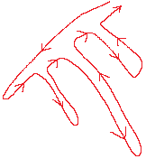

题目简述：

> 给你一棵二叉树的根节点 `root` ，返回其节点值的 **后序遍历** 。

题目连接：[145. 二叉树的后序遍历](https://leetcode.cn/problems/binary-tree-postorder-traversal/)

# 递归

递归没啥好说的，十分简单。

```java
/**
 * Definition for a binary tree node.
 * public class TreeNode {
 *     int val;
 *     TreeNode left;
 *     TreeNode right;
 *     TreeNode() {}
 *     TreeNode(int val) { this.val = val; }
 *     TreeNode(int val, TreeNode left, TreeNode right) {
 *         this.val = val;
 *         this.left = left;
 *         this.right = right;
 *     }
 * }
 */


class Solution {
    List<Integer> res;
    
    public List<Integer> postorderTraversal(TreeNode root) {
        res = new ArrayList<>();
        dfs(root);
        return res;
    }

    private void dfs(TreeNode root) {
        if (root == null) return;
        dfs(root.left);
        dfs(root.right);
        res.add(root.val);
    }
}
```

# 显式栈 + 非递归（利用先序遍历）

显式栈非递归迭代实现DFS，前序遍历的方式最简单，只需要一个 while 循环与栈就可以实现，就像BFS层序遍历使用队列那样使用栈就好了。中序遍历相对复杂一点，标准的实现方案是通过嵌套内层 while 循环优先访问左子树并持续压栈，再在外层 while 循环中、内层 while 循环后处理根节点并尝试将指针迁移至右子树。中序遍历的非递归迭代实现可以参考我在第98题验证二叉搜索树的题解中给出的算法。

相应地，显式栈非递归迭代后序遍历的算法实现是最复杂的。和中序遍历一样，常见的一种实现是直接按后序遍历定义的逻辑编写算法，也用到嵌套 while 循环并在内层循环中优先访问左子树并压栈，但***需要使用额外的标志表示该节点的右子树是否已被处理***。

---

但是！但是！！但是！！！但是！！！！但是！！！！！如果只需要最终遍历的值数组而在遍历中不存在其他操作的逻辑，则后序遍历其实可以由前序遍历修改而来！只需要：

1. ***交换左右子节点的入栈顺序；***
2. ***最后对得到的结果数组进行翻转。***

就好了！！！！！（为什么可以呢？请仔细想一想~）

这个方法也被称为***双栈法***，因为数组翻转可以通过两个栈间的倾倒实现，区别于状态标记的***单栈法***。

---

具体来说，我们先编写一个非递归前序遍历：

```java
class Solution {
    public List<Integer> preorderTraversal(TreeNode root) {
        Deque<TreeNode> stack = new ArrayDeque<>();
        List<Integer> res = new ArrayList<>();
        if (root != null) stack.push(root);

        while (!stack.isEmpty()) {
            TreeNode cur = stack.pop();
            res.add(cur.val);

            if (cur.right!= null) stack.push(cur.right);
            if (cur.left!= null) stack.push(cur.left);
        }

        return res;
    }
}
```

然后我们交换左右子节点入栈的顺序，再反转结果数组：

```java
class Solution {
    public List<Integer> postorderTraversal(TreeNode root) {
        Deque<TreeNode> stack = new ArrayDeque<>();
        List<Integer> res = new ArrayList<>();
        if (root != null) stack.push(root);

        while (!stack.isEmpty()) {
            TreeNode cur = stack.pop();
            res.add(cur.val);
            
            if (cur.left!= null) stack.push(cur.left);
            if (cur.right!= null) stack.push(cur.right);
        }

        return res.reversed();
    }
}
```

大功告成！！！

# 显式栈 + 非递归（状态标记）

如上所述，我们需要用一个节点 `prev` 标记上一个处理了右子树的前驱节点，避免重复处理右子树。

当需要严格按后序遍历定义的逻辑进行访问时，例如需要在遍历时做一些额外的操作，

```java
class Solution {
    public List<Integer> postorderTraversal(TreeNode root) {
        Deque<TreeNode> stack = new ArrayDeque<>();
        List<Integer> res = new ArrayList<>();
        TreeNode prev = null;

        while (root != null || !stack.isEmpty()) {
            // 1. 非空节点入栈，并优先向左子树试探
            while (root != null) {
                stack.push(root);
                root = root.left;
            }

            TreeNode cur = stack.peek();
            // 2. 左子树已访问后，如果右子树存在且未处理，则访问右子树
            if (cur.right != null && cur.right != prev) {
                root = cur.right;
            } else {
                // 3. 当访问完全部的子树时，处理当前节点，并更新前驱节点 prev
                res.add(cur.val);
                prev = stack.pop();
            }
        }
        return res;
    }
}
```

一定要深刻理解，这也是一种很重要的后序遍历实现，而且细节超多。觉得难理解就先背一下算法的结构。

我是这样理解这个算法的：我们先考察个简单点的情况，考虑如下形状的树，


这棵树的特点是所有节点的右子树都不存在左子子树，即进入条件分支 `if (cur.right != null && cur.right != prev)`、赋值 `root = cur.right;` 并进入下一轮循环后不再触发 `while (root != null)` 的情况，那么

1. `root` 首先会不断从整棵树的根节点开始沿着最左边——即图中***暗红色的节点们一路向左下“滑动”***，直到最左边的尽头，并且在滑动的同时不断把访问的节点压入栈；
1. 抵达最左边尽头后 `root` 的值为 `null` 且不存在左右子树，于是在外层循环中只执行 `res.add(cur.val);` 和 `prev = stack.pop();` 将结果添加到列表中，同时赋值标志节点 `prev = stack.pop();`，此时 `prev` 就是最左下方的节点；
1. 注意哈，***此时 `root` 的值还是 `null`***，所以如果暗红色的边最左下角有一段全都不存在右子树，则都会直接执行 else 逻辑，不断把值加入到结果添加到列表中并不断出栈，而且出栈的同时更新标志节点 `prev`，直到栈顶 `cur` 存在右子节点时我们重新将一直处于 `null` 的 `root` 赋值为右子节点，即图中***天蓝色的节点***，这是从左下角往全局根节点看的第一棵非空右子树的根节点；
1. 由于我们假设所有节点的右子树都不存在左子树，因此 `root` 会触发一次条件 `while (root != null)` 从而将天蓝色节点压入栈，但在内循环中接着会执行一次 `root = root.left;`，由于我们假设 `root.left` 为空，因此第一次内循环结束后不再满足条件 `while (root != null)`，于是跳出循环，继续执行下面的代码。由于右子树非空，因此满足条件 `if (cur.right != null && cur.right != prev)`，然后 `root` 被赋值 `cur.right` ——就这样，`root` ***从天蓝色节点起沿一直向右下“滑动”访问灰色的节点们***，直到这棵（天蓝色节点的）右子树尽头，并且在滑动的同时不断把访问的节点压入栈；
1. 抵达灰色节点们尽头后 `root` 的值为 `null`，由于非空右子树不再存在，不满足 `if (cur.right != null && cur.right != prev)` 条件，因此执行 else 逻辑，每次都将结果逆着首次访问的顺序从栈中吐出，将节点的值加入到列表中并更新 `prev` 为出栈的节点。这样，在下一次外层循环中虽然满足 `cur.right != null` 但不满足 `cur.right != prev`，因为 ***`prev` 代表已访问的右子节点***，于是继续执行 else 逻辑，继续把下一个节点的值加入到列表中、继续出栈并继续更新 `prev`，直到回到栈中的天蓝色节点的父节点，此时 `prev` 是天蓝色节点，因此算法将继续向全局根节点访问，也就是继续让栈中暗红色的节点们出栈——直到遇到第二个非空右子树。
1. 然后就是重复上述过程了~
1. 可以看出，***`prev` 的作用是保证对已处理的右子树逆着首次访问顺序出栈时，标记刚刚出栈的右子节点已处理，不再重复向其右子节点试探***。

也就是说，在我们的假设下，访问的顺序是这样的：



并且只有逆着次访问的顺序出栈时才进行操作，即把节点的值加入到列表中。

那么，对更一般的树，也就是右子树可能存在左子子树怎么办呢？没有任何问题！因为 `while (root != null)` 确保了只要左子子树存在那么算法就一定会先进入左子子树！只要左子节点存在，算法就会去探索，这是优先级最高的条件，而这一优先级是靠内层 while 循环保证的。于是，只要算法进入了左子子树，大的遍历问题就变成子问题了，他们是相似的，从而我们的算法依然能正常工作。

---

记忆的关键是“211”，即如果不考虑对父节点的额外操作，则三个分支中分别只有2个语句、1个语句与1个语句：

- 入栈与向左子树不断试探的 while 循环中只有 `stack.push(root);` 与 `root = root.left;`，即***压栈***与***左移***两个操作；
- 向右子树试探一步的分支 `if (cur.right != null && cur.right != prev)` 只有 `root = cur.right;`，即***右移***操作；
- 对已访问左右子树的节点只有 `prev = stack.pop();`，即***出栈更新标记***操作；

千万不要在右移时压栈。

也不要忘记 `TreeNode cur = stack.peek();`，这里是 `peek()` 不是 `pop()`。

内循环***不仅能优先向左子树试探***，还有***将非空节点压入栈***的作用！

---

<span style="color: red">2025/06/18 更（温故而知新？）：搞清楚 `root` 和 `cur` 在算法中的职责与行为。`root` 只负责引导深度优先向下搜索（更准确地说，是左子树优先），并将算法聚焦点推进到下一颗待处理的子树；`cur` 负责检查当前节点的状态，为栈顶的节点，如果右子树已被处理，则处理当前节点，否则引导 `root` 向右子树探索。</span><br><span style="color: red">算法中每个节点均将被访问 3 次：一次推入栈，一次 peek 检查，一次 pop 处理。</span>

---

2025/07/04 更：重写了一遍，

```java
class Solution {
    public List<Integer> postorderTraversal(TreeNode root) {
        List<Integer> res = new ArrayList<>();
        Deque<TreeNode> stack = new ArrayDeque<>();
        TreeNode prev = null;

        while (root != null || !stack.isEmpty()) {
            while (root != null) {
                stack.push(root);
                root = root.left;
            }

            TreeNode top = stack.peek();
            if (top.right != null && top.right != prev) {
                root = top.right;
            } else {
                res.add(top.val);
                prev = stack.pop();
            }
        }

        return res;
    }
}
```
