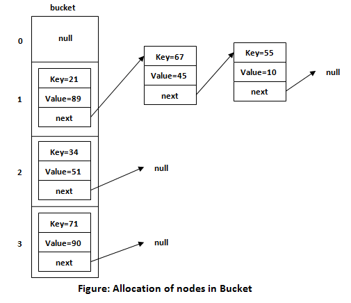

题目简述：

> 请你设计并实现一个满足LRU (最近最少使用) 缓存约束的数据结构。
>
> 实现 `LRUCache` 类：
>
> - `LRUCache(int capacity)` 以 **正整数** 作为容量 `capacity` 初始化 LRU 缓存
> - `int get(int key)` 如果关键字 `key` 存在于缓存中，则返回关键字的值，否则返回 `-1` 。
> - `void put(int key, int value)` 如果关键字 `key` 已经存在，则变更其数据值 `value` ；如果不存在，则向缓存中插入该组 `key-value` 。如果插入操作导致关键字数量超过 `capacity` ，则应该 **逐出** 最久未使用的关键字。
>
> 函数 `get` 和 `put` 必须以 `O(1)` 的平均时间复杂度运行。

题目链接：[146. LRU 缓存](https://leetcode.cn/problems/lru-cache/)

# 最初的想法

我服了，最初我是最脑残的方式实现的，毕竟没看过LinkedHashMap的源码，以前也没接触过LRU的具体软件实现。洋洋洒洒折腾两三个小时，改脑中残的bug都改了好久，最后能运行，然后在最后两个测试用例超时，给我自己都整笑了。

```java
class LRUCache {
    /*
    historyList records the keys in order of their most recent access time
     */
    private final LinkedList<Integer> historyList;
    private final int[] keyArr;
    private final int[] valueArr;
    private final int capacity;

    public LRUCache(int capacity) {
        this.historyList = new LinkedList<Integer>();
        this.keyArr = new int[capacity];
        this.valueArr = new int[capacity];
        this.capacity = capacity;
    }

    private boolean reorderHistoryForGet(int key) {
        for (int i = 0; i < this.historyList.size(); i++) {
            if (this.historyList.get(i) == key) {
                this.historyList.remove(i);
                this.historyList.addFirst(key);
                return true;
            }
        }
        return false;
    }

    public int get(int key) {
        for (int i = 0; i < this.historyList.size(); i++) {
            if (this.keyArr[i] == key) {
                this.reorderHistoryForGet(key);
                return this.valueArr[i];
            }
        }
        return -1;
    }

    public void put(int key, int value) {
        int size = this.historyList.size();
        for (int i = 0; i < size; i++) {  // case 1: Key existed
            if (this.keyArr[i] == key) {
                this.historyList.remove((Integer) key);
                this.historyList.addFirst(key);
                this.valueArr[i] = value;
                return;
            }
        }

        if (size < this.capacity) {       // case 2: Key doesn't exist but there is a vacancy
            this.historyList.addFirst(key);
            this.keyArr[size] = key;
            this.valueArr[size] = value;
        } else {                          // case 3: Key doesn't exist and there is no vacancy
            int obsoleteKey = this.historyList.removeLast();
            this.historyList.addFirst(key);
            for (int j = 0; j < this.capacity; j++) {
                if (this.keyArr[j] == obsoleteKey) {
                    this.keyArr[j] = key;
                    this.valueArr[j] = value;
                    return;
                }
            }
        }
    }
}
```

不过说实话，我这也确实该超时，太多遍历查表的过程了，题目要求的时间复杂度得是 $O(1)$，我这显然不是。

这个实现的逻辑是拿两个数组分别存储key和value，再拿一个链表存储key最近访问/使用的顺序，链表中只存储key，链表的顺序就是key最近访问/使用的顺序。只能说模拟出来了LRU的效果，但性能很差很差。

# LinkedHashMap源码分析

## 基于HashMap

其实LRU算法的功能LinkedHashMap都已经给我们实现好了，我们直接用就行了，但为了深入理解，我们来看看源码。

首先我们要了解一下Java的LinkedHashMap在底层是怎么实现的。LinkedHashMap基于HashMap，HashMap就是数组 + 红黑树 + 链表：



LinkedHashMap在HashMap的基础上添加了双向链表结构，也就是说支持顺序了，本来HashMap是无序的。具体而言，在节点Entry中添加指向上一个元素的指针 before 和下一个元素的指针 `after`，使之形成链表，再记录首元素指针 `head` 和尾元素指针 `tail` 形成双向链表，稍后我们可以在源码中看到这一点。

LinkedHashMap的 `get` 和 `put` 基于HashMap，本来就是 $O(1)$ 的，如果要利用LinkedHashMap那就只需要考虑如何利用LinkedHashMap的有序性实现最近最久未使用更新。

注：实际上LinkedHashMap基于HashMap的 `put` 的、会自动扩容的那俩方法是 `putFirst` 和 `putLast`，方便起见合称 `put` 了。

## 节点Entry

我们先大概看看节点，LinkedHashMap的节点  `Entry` 继承自HashMap的 `Node`，不同的是额外添加了  `before` 和  `after` 指针，实现有序，我们现在来看看 `Entry` 的源码：

```java
public class LinkedHashMap<K,V> extends HashMap<K,V> implements SequencedMap<K,V>
{

    static class Entry<K,V> extends HashMap.Node<K,V> {
        Entry<K,V> before, after;
        Entry(int hash, K key, V value, Node<K,V> next) {
            super(hash, key, value, next);
        }
    }

    transient LinkedHashMap.Entry<K,V> head;

    transient LinkedHashMap.Entry<K,V> tail;

    final boolean accessOrder;

    ...
```

注意这里还有个  `accessOrder` 字段，该字段默认为  `False` ，意思是按照元素的插入顺序维护键值对的遍历顺序，如果通过构造函数  `LinkedHashMap(int, float, boolean)` 设为 `True` 则访问操作 `get` 也会将元素移动到链表尾部——而不光光是 `put` 才触发。

## put（putFirst 和 putLast）

接下来我们先看看 `put` 是怎么更新顺序的，毕竟无论 `accessOrder` 的值是什么，LinkedHashMap都会记录下插入的顺序。不过 `put` 本身不包含实际维护顺序的逻辑，顺序的维护是通过重写 `newNode` 回调将节点追加到双向链表的首部或尾部实现的。

```java
    ...
    
    private void linkNodeAtEnd(LinkedHashMap.Entry<K,V> p) {
        if (putMode == PUT_FIRST) {
            LinkedHashMap.Entry<K,V> first = head;
            head = p;
            if (first == null)
                tail = p;
            else {
                p.after = first;
                first.before = p;
            }
        } else {
            LinkedHashMap.Entry<K,V> last = tail;
            tail = p;
            if (last == null)
                head = p;
            else {
                p.before = last;
                last.after = p;
            }
        }
    }
    
    ...

    public V putFirst(K k, V v) {
        try {
            putMode = PUT_FIRST;
            return this.put(k, v);
        } finally {
            putMode = PUT_NORM;
        }
    }

    public V putLast(K k, V v) {
        try {
            putMode = PUT_LAST;
            return this.put(k, v);
        } finally {
            putMode = PUT_NORM;
        }
    }

    ...
    
    Node<K,V> newNode(int hash, K key, V value, Node<K,V> e) {
        LinkedHashMap.Entry<K,V> p = new LinkedHashMap.Entry<>(hash, key, value, e);
        linkNodeAtEnd(p);
        return p;
    }
    
    ...
```

可以看到， `put` 时直接维护双向链表的首尾指针 `head` 与 `tail` 就好了，没有很复杂的逻辑。

至于缓存容量被设置为有限的这点——那插入的同时直接丢掉尾巴不就好了，只不过在丢的同时把尾巴指向的前一个元素设置为新的尾巴。但是LinkedHashMap的 `put` 是完全基于HashMap本来的 `put` 的，她默认 `put` 时自动扩容而不存在缓存容量上限的概念，所以我们不能直接调用这两个。这里介绍他俩只是为了探究LinkedHashMap源码并引出  `removeEldestEntry`，我们重写了这个 `put` 才会帮我们检查是否达到设定的缓存容量上限并在必要的时候删掉最老元素。

## get 和 getOrDefault

我们再看看 `get` 的源码。

```java
    ...
    
    public V get(Object key) {
        Node<K,V> e;
        if ((e = getNode(key)) == null)
            return null;
        if (accessOrder)
            afterNodeAccess(e);
        return e.value;
    }

    ...

    void afterNodeAccess(Node<K,V> e) {
        LinkedHashMap.Entry<K,V> last;
        LinkedHashMap.Entry<K,V> first;
        if ((putMode == PUT_LAST || (putMode == PUT_NORM && accessOrder)) && (last = tail) != e) {
            // move node to last
            LinkedHashMap.Entry<K,V> p =
                (LinkedHashMap.Entry<K,V>)e, b = p.before, a = p.after;
            p.after = null;
            if (b == null)
                head = a;
            else
                b.after = a;
            if (a != null)
                a.before = b;
            else
                last = b;
            if (last == null)
                head = p;
            else {
                p.before = last;
                last.after = p;
            }
            tail = p;
            ++modCount;
        } else if (putMode == PUT_FIRST && (first = head) != e) {
            // move node to first
            LinkedHashMap.Entry<K,V> p =
                (LinkedHashMap.Entry<K,V>)e, b = p.before, a = p.after;
            p.before = null;
            if (a == null)
                tail = b;
            else
                a.before = b;
            if (b != null)
                b.after = a;
            else
                first = a;
            if (first == null)
                tail = p;
            else {
                p.after = first;
                first.before = p;
            }
            head = p;
            ++modCount;
        }
    }

    ...
```

可以看到 `get` 通过 `afterNodeAccess` 实现更新顺序的逻辑，看起来 `afterNodeAccess` 还挺冗长的，但我们仔细研究就会发现如果抛开更新模式不谈只以 `putMode == PUT_LAST` 为例的话，其实他就是做了以下的事情：

1. 断开当前节点与前后节点的连接；
2. 将当前节点链接到链表尾部，更新尾指针 `tail` 。

也没有什么难的嘛。（真的假的？）

至于 `getOrDefault`，他就是给 `get` 加了个默认值以符合类似题目要求键不存在时返回 `-1` 的设定，源码如下：

```java
    ...

    public V getOrDefault(Object key, V defaultValue) {
       Node<K,V> e;
       if ((e = getNode(key)) == null)
           return defaultValue;
       if (accessOrder)
           afterNodeAccess(e);
       return e.value;
   }

   ...
```

## removeEldestEntry 与 afterNodeInsertion

这玩意源码如下，本身没提供实现：

```java
    ...

    void afterNodeInsertion(boolean evict) { // possibly remove eldest
        LinkedHashMap.Entry<K,V> first;
        if (evict && (first = head) != null && removeEldestEntry(first)) {
            K key = first.key;
            removeNode(hash(key), key, null, false, true);
        }
    }

    ...

    protected boolean removeEldestEntry(Map.Entry<K,V> eldest) {
        return false;
    }

    ...
```

这个就是帮助我们实现淘汰最久未使用元素的关键。具体来说，LinkedHashMap的 put 方法继承自HashMap的 `put` 实现，而HashMap的 `put` 方法在完成节点插入后会调用 `afterNodeInsertion` 进行后续的行为——默认是无后续行为，所以直接调用 `put` 默认行为就只是添加，容量不够就扩容，没有包括删除最老元素在内的后续操作。

更专业、标准的话来说，`afterNodeInsertion` 是HashMap留给子类扩展的钩子方法（Hook）。LinkedHashMap重写了 `afterNodeInsertion`，重写后他将结合 `removeEldestEntry` 返回的布尔值确认是否要删除最老元素。

不过观察源码，`removeEldestEntry` 默认只返回 false，因此 `afterNodeInsertion` 默认情况下永不触发，所以我们需要自行重写并定义一下删除最老元素的时机。在LRU中，这个时机就是元素数量超过指定的capacity。

# 利用LinkedHashMap快速实现LRU（避免重复造轮子？）

看了源码以后要利用LinkedHashMap实现LRU就超级容易了，毕竟 `java.util` 都帮我们实现好了全部功能直接用就行了，如下所述：

```java
class LRUCache {
    private LinkedHashMap<Integer, Integer> map;
    private final int capacity;

    public LRUCache(int capacity) {
        this.capacity = capacity;
        map = new LinkedHashMap<Integer, Integer>(capacity, 0.75f, true) {
            @Override
            protected boolean removeEldestEntry(Map.Entry<Integer, Integer> eldest) {
                return size() > LRUCache.this.capacity;
            }
        };
    }

    public int get(int key) {
        return map.getOrDefault(key, -1);
    }

    public void put(int key, int value) {
        map.put(key, value);
    }
}
```

# 利用哈希表/映射/字典根据LinkedHashMap原理自己设计LRU算法（重复造轮子）

不管具体是怎么实现的，和LinkedHashMap的原理一样，都是使用一个哈希表和一个双向链表，结构如下：


只有这样才能做到 $O(1)$ 时间复杂度的get和put。如上所述，这其实也就是LinkedHashMap的样子。

```java
class LRUCache {
    /*
    head <- ... <- prev  <- Entry <- next <- ... <- tail
     */
    private HashMap<Integer, Entry> map;
    private final int capacity;
    private int size;
    private Entry head;
    private Entry tail;

    private class Entry {
        int key, value;
        Entry prev, next;

        public Entry(int key, int value, Entry prev, Entry next) {
            this.key = key;
            this.value = value;
            this.prev = prev;
            this.next = next;
        }
    }

    public LRUCache(int capacity) {
        this.capacity = capacity;
        size = 0;
        head = null;
        tail = null;
        map = new HashMap<>((int) (capacity / 0.75f) + 1, 1.0f);;
    }

    public int get(int key) {
        if (map.containsKey(key)) {
            Entry e = map.get(key);
            if (e.next != null && e.prev != null) {
                e.next.prev = e.prev;
                e.prev.next = e.next;
            } else if (e.next == null && e.prev != null) {
                e.prev.next = null;
                tail = e.prev;
            } else {
                return e.value;
            }
            head.prev = e;
            e.prev = null;
            e.next = head;
            head = e;
            return e.value;
        } else {
            return -1;
        }
    }

    public void put(int key, int value) {
        if (map.containsKey(key)) {
            Entry e = map.get(key);
            e.value = value;
            if (e.next != null && e.prev != null) {
                e.next.prev = e.prev;
                e.prev.next = e.next;
            } else if (e.next == null && e.prev != null) {
                e.prev.next = null;
                tail = e.prev;
            } else {
                return;
            }
            head.prev = e;
            e.prev = null;
            e.next = head;
            head = e;
        } else {
            if (size == 0) {
                Entry e = new Entry(key, value, null, null);
                map.put(key, e);
                head = e;
                tail = e;
                size++;
                return;
            }
            if (size < capacity) {
                Entry e = new Entry(key, value, null, head);
                map.put(key, e);
                head.prev = e;
                head = e;
                size++;
            } else {
                if (size != 1) {
                    Entry newTail = tail.prev;
                    newTail.next = null;
                    map.remove(tail.key);
                    tail = newTail;
                    Entry e = new Entry(key, value, null, head);
                    map.put(key, e);
                    head.prev = e;
                    head = e;
                } else {
                    map.remove(head.key);
                    Entry e = new Entry(key, value, null, null);
                    map.put(key, e);
                    head = e;
                    tail = e;
                }
            }
        }
    }
}
```

效果贼好。对于支持指针的编程语言，还可以用指针，由于Java没指针所以我用的对象引用。

我让AI利用哨兵节点为我美化了下代码，简洁不少：

```java
class LRUCache {
    class Node {
        int key, val;
        Node prev, next;
        Node(int k, int v) { key=k; val=v; }
    }

    private final HashMap<Integer, Node> map = new HashMap<>();
    private final Node head = new Node(-1, -1), tail = new Node(-1, -1);
    private final int capacity;

    public LRUCache(int capacity) {
        this.capacity = capacity;
        head.next = tail;
        tail.prev = head;
    }

    public int get(int key) {
        if (!map.containsKey(key)) return -1;
        Node node = map.get(key);
        moveToHead(node);
        return node.val;
    }

    public void put(int key, int value) {
        if (map.containsKey(key)) {
            Node node = map.get(key);
            node.val = value;
            moveToHead(node);
        } else {
            if (map.size() == capacity) {
                map.remove(tail.prev.key);
                removeNode(tail.prev);
            }
            Node newNode = new Node(key, value);
            map.put(key, newNode);
            addToHead(newNode);
        }
    }

    private void addToHead(Node node) {
        node.next = head.next;
        node.prev = head;
        head.next.prev = node;
        head.next = node;
    }

    private void removeNode(Node node) {
        node.prev.next = node.next;
        node.next.prev = node.prev;
    }

    private void moveToHead(Node node) {
        removeNode(node);
        addToHead(node);
    }
}
```

也可以既不用指针也不用引用实现，但至少在Java里这样性能是很低很低的：

```java
class LRUCache {
    /*
    head <- ... <- prev  <- Entry <- next <- ... <- tail
     */
    private HashMap<Integer, Entry> map;
    private final int capacity;
    private final int nothing = -2147483648;
    private int size;
    private int head;
    private int tail;

    private class Entry {
        int value;
        int prev;
        int next;

        public Entry(int key, int value, int prev, int next) {
            this.value = value;
            this.prev = prev;
            this.next = next;
        }
    }

    public LRUCache(int capacity) {
        this.capacity = capacity;
        size = 0;
        head = nothing;
        tail = nothing;
        map = new HashMap<>((int) (capacity / 0.75f) + 1, 1.0f);;
    }

    public int get(int key) {
        if (map.containsKey(key)) {
            Entry e = map.get(key);
            if (e.next != nothing && e.prev != nothing) {
                map.get(e.next).prev = e.prev;
                map.get(e.prev).next = e.next;
            } else if (e.next == nothing && e.prev != nothing) {
                map.get(e.prev).next = nothing;
                tail = e.prev;
            } else {
                return e.value;
            }
            map.get(head).prev = key;
            e.prev = nothing;
            e.next = head;
            head = key;
            return e.value;
        } else {
            return -1;
        }
    }

    public void put(int key, int value) {
        if (map.containsKey(key)) {
            Entry e = map.get(key);
            e.value = value;
            if (e.next != nothing && e.prev != nothing) {
                map.get(e.next).prev = e.prev;
                map.get(e.prev).next = e.next;
            } else if (e.next == nothing && e.prev != nothing) {
                map.get(e.prev).next = nothing;
                tail = e.prev;
            } else {
                return;
            }
            map.get(head).prev = key;
            e.prev = nothing;
            e.next = head;
            head = key;
        } else {
            if (size == 0) {
                map.put(key, new Entry(key, value, nothing, nothing));
                head = key;
                tail = key;
                size++;
                return;
            }
            if (size < capacity) {
                map.put(key, new Entry(key, value, nothing, head));
                map.get(head).prev = key;
                head = key;
                size++;
            } else {
                if (size != 1) {
                    int newTail = map.get(tail).prev;
                    map.get(newTail).next = nothing;
                    map.remove(tail);
                    tail = newTail;
                    map.put(key, new Entry(key, value, nothing, head));
                    map.get(head).prev = key;
                    head = key;
                } else {
                    map.remove(head);
                    map.put(key, new Entry(key, value, nothing, nothing));
                    head = key;
                    tail = key;
                }
            }
        }
    }
}
```

