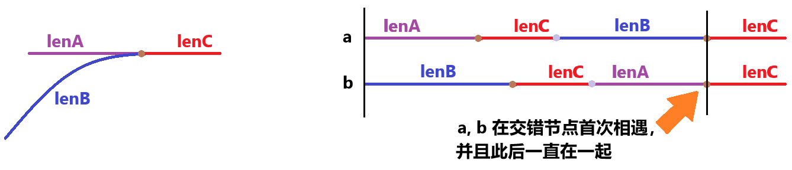

题目简述：

> 给你两个单链表的头节点 `headA` 和 `headB` ，请你找出并返回两个单链表相交的起始节点。如果两个链表不存在相交节点，返回 `null` 。
>
> 题目数据 **保证** 整个链式结构中不存在环。
>
> **注意**，函数返回结果后，链表必须 **保持其原始结构** 。

题目链接：[160. 相交链表](https://leetcode.cn/problems/intersection-of-two-linked-lists/)

# 方法一，哈希表检验重复

提到重复检验那就不得不尝试下哈希表了，虽然内存开销可能比较大，哈希碰撞后时间开销也比较大，但不失为一种方法，而且还是一种的确可行的方法。

注意这个问题不准改 `val` 字段。

```java
/**
 * Definition for singly-linked list.
 * public class ListNode {
 *     int val;
 *     ListNode next;
 *     ListNode(int x) {
 *         val = x;
 *         next = null;
 *     }
 * }
 */


public class Solution {
    public ListNode getIntersectionNode(ListNode headA, ListNode headB) {
        HashSet<ListNode> set = new HashSet<>();
        while (headA != null) {
            set.add(headA);
            headA = headA.next;
        }
        while (headB != null) {
            if (set.contains(headB)) return headB;
            headB = headB.next;
        }
        return null;
    }
}
```

# 方法二，非常巧妙的双指针

这个问题也可以用双指针来做。初见完全没思路，想到可能要用双指针，但想不到如何利用双指针，看了别人的解析后一时摸不着头脑，顿悟以后感叹惊为天人。这题要是不准用哈希表我觉得高低是个hard吧，初见根本想不到。我们先说说这个双指针如何实现，再来解释为什么这样可以实现，只有这样才能感受到本问题双指针应用的精妙绝伦，不然只会对一大段推导感到一头雾水。

定义两个指针 a 和 b：

1. 起初，让 a 从 headA 出发，b 从 headB 出发，两者每次均递增一步，直到其中一个指针第一次遍历完了链表，或者两者同时遍历完链表。如果在此期间二者相遇了则可以提前结束程序，这说明两链表交错且等长，但也可以不予理会，统一只关注第二次遍历。
2. a、b 在遍历完各自的链表后就立刻移至另一条未遍历的链表表头并重新遍历，即第二次遍历。一方开始第二次遍历不影响另一方的第一次或第二次遍历。
3. 如果 a、b 最终相遇了，那么相遇时两者所处的节点就是交错节点；否则，a、b 必然在各自第二次遍历中同时抵达两个链表的终点，意味着两条链表平行，永不相交。

是不是好像有点领悟到什么了？

> ***如果命运让我们再见，那我们一定会相遇的！***

直观上来说，这个方法充分利用了对称性。我们先考虑两个链表平行的情况，假设链表A长为 lenA、链表B长为 lenB，那么当 a 进行完两次遍历到达终点时走过了 lenA + lenB 长的路，b 经过 lenA + lenB 的路也恰到达了终点。不管是 a 先遍历链表A还是 b 先遍历链表A，他们最终都遍历了两条链表，都在走了 lenA + lenB 长的路以后到达同时到达不同链表的终点。

接着考虑两个链表相交的情况。假设链表A在和链表B相交以前的长度为 lenA，链表B在和链表A相交以前的长度为 lenB，两者相交后的共同长度为 lenC，那么：

- 在 a、b 经历完第一次遍历前，二者没有必然联系。如果两链表等长，则他们会在第一次遍历时相遇；否则不可能在第一次遍历时相遇。不妨让 a 第一次遍历链表A，b 第一次遍历链表B。

- 当 a、b 中有一方已经开始了第二次遍历但未第二次到达交错节点时，即其中一方处于第二次遍历但当前位置处于链表A的 [0, lenA) 或链表B的 [0, lenB) 时，二者一定不可能相交。不妨设此时 a 处于第二次遍历且正位于链表B的节点beta处，beta 在 [0, lenB) 范围内，则此时 a 走过的路长度是 lenA + lenC + beta，因此这时 b

  - 要么正在第一次遍历而且位于链表B的 lenA + lenC + beta 处，根据前提条件，a 正位于链表A的交错节点前，因此不论 lenA + lenC + beta 在链表B上到底是哪个位置，a 都不可能与正在链表B上的 b 相遇——无论 b 在链表B交错节点的前还是后 ，两者必然不可能在此时相遇。
  - 要么也在第二次遍历而而且位于链表A的 (lenA + lenC + beta) - lenB - lenC = lenA + beta - lenB 处，记该位置为 alpha，由于 0 ≤ beta < lenB，因此 lenA - lenB ≤ alpha < lenA，即 b 正在链表A的交错节点前，而根据定义，a 所处的链表B的位置 beta 和 b 所处的链表A的位置 alpha 均属于各自链表交错前的部分，因此二者不可能在此时相遇。

- 但是，一旦一方已经处于第二次遍历而且当前位置处于链表A的 [lenA, lenA + lenC) 或链表B的 [lenB, lenB + lenC)，则他们必然已经相遇。不妨设 a 在这个情况下位于链表B的 gamma 位置处， gamma 在 [lenB, lenB + lenC) 范围内，则 a（和 b）已经（分别）走过了 lenA + lenC + gamma ≥ lenA + lenC + lenB 的路。对于 b 来说，由于 lenA + lenC + lenB ≥ len B + lenC，因此 b 一定已经在链表A上，即正在进行第二次遍历，并且还是在链表A的 (lenA + lenC + gamma) - lenB - lenC = lenA + gamma - lenB 处。

  事实上，链表A的 lenA + gamma - lenB处与链表B的 gamma 处都在交错节点以后，而且所对应的节点就是同一个节点！根据 gamma 的定义，我们知道链表B的 gamma 处所对应的节点一定是交错节点及其以后的节点。那么，要证明这个结果就只需要说明链表链表A的 lenA + gamma - lenB 处与链表B的 gamma 处是同一个节点——这是不言自明的，因为 lenA - lenB 本来就表示链表A与链表B的长度差值。

  换个角度看更直观，当两指针位于交错节点时，二者都走了 lenA + lenB + lenC 的路。如果我们把链表A与链表B相接，分别让链表A做头、让链表B做头，如下图所示，很形象地展示了为什么在第二次遍历中从交错节点起二者开始位于同一节点。

  

综上所述，我们只需要按描述设计双指针算法，就可以找到交错节点啦~

```java
public class Solution {
    public ListNode getIntersectionNode(ListNode headA, ListNode headB) {
        ListNode a = headA;
        ListNode b = headB;
        boolean firstVisited = true;

        while (a.next != null || firstVisited) {
            if (a == b) return a;
            if (a.next == null && firstVisited) firstVisited = false;
            a = a.next != null ? a.next : headB;
            b = b.next != null ? b.next : headA;
        }
        if (a == b) return a;

        return null;
    }
}
```
