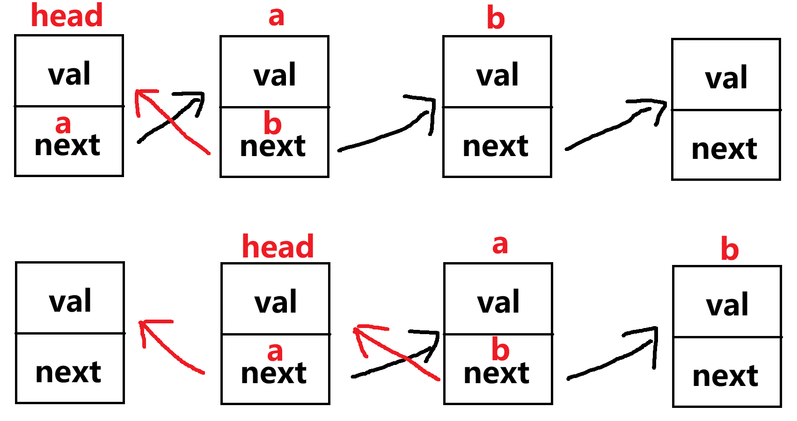

题目简述：

> 给你单链表的头节点 `head` ，请你反转链表，并返回反转后的链表。

题目连接：[206. 反转链表](https://leetcode.cn/problems/reverse-linked-list/)

#  迭代

迭代是没啥难度的，按下面这个示意图写代码就行，就是遍历下链表，然后每当遍历到新节点时处理一下，同时复用变量名以进行下一次迭代，保证下一次迭代时几个变量的相对关系是不变的（也就是让a等于head.next、b等于a.next）但他们又都向后移了一步（也就是下一次迭代时的a就是上次迭代的head、下一次迭代时的b就是上次迭代的a）。

比较显然的是这个逻辑可以改造成递归调用。



代码如下：

```java
/**
 * Definition for singly-linked list.
 * public class ListNode {
 *     int val;
 *     ListNode next;
 *     ListNode() {}
 *     ListNode(int val) { this.val = val; }
 *     ListNode(int val, ListNode next) { this.val = val; this.next = next; }
 * }
 */


class Solution {
    public ListNode reverseList(ListNode head) {
        if (head == null || head.next == null) { return head; }
        ListNode a = head.next;
        head.next = null;
        while (a != null) {
            ListNode b = a.next;
            a.next = head;
            if (b == null) {
                return a;
            }
            head = a;
            a = b;
        }
        return null;
    }
}
```

#  递归

递归我想了一会，虽然这是个简单的问题，但我总感觉绕进去了，说明我还不够熟练。

现在看来，要解决递归，最重要的问题是研究递归调用前和递归调用后分别要做什么。

## STEP 1：确定父递归调用的输入和输出

首先只确定递归体的输入和输出的含义，**不要管内部如何实现**。

根据递归体的输入和输出的含义，我们可以进一步分别写出整个递归体的具体输入输出含义，以及递归体内部的递归调用的具体输入输出含义，如下代码所示，我已将含义写在了注释中。

```java
class Solution {

    // 1. 输入值为节点head，递归体需要反转从链表原本的头节点到head节点范围的子链表
    public ListNode reverseList(ListNode head) {

        // 2. 输入为head的下一个节点head.next
        // 3. 根据1.规定的含义，假定该递归调用反转了从链表原本的头节点到head.next节点范围的子链表；
        //    这里就构造出了子问题，稍后实现时实际只需要将head.next作为新反转子链表的头节点即可。
        // 4. 返回新反转子链表的头节点
        ListNode nextNode = reverseList(head.next);

        // 5. 返回值为从链表原本的头节点到head节点范围的子链表反转后的头节点head.next
        return nextNode;
    }
}
```

这样我们就构造出来了子问题。

## STEP 2：确定递归调用的base case，即终止条件

当head本身就是空节点，或者head的下一个节点是空的，就返回自身。

注意这里head其实是当前节点的意思，而不只是首个节点。

```java
class Solution {
    public ListNode reverseList(ListNode head) {
        // 原链表为空或者head已经是原链表的尾节点时，返回head
        if (head == null || head.next == null) { return head; }

        ListNode nextNode = reverseList(head.next);

        return nextNode;
    }
}
```

我们来根据STEP 1的设计判断一下该终止条件分支的行为是否合理：

- 如果原链表为空则直接返回null，合理；
- 如果head已经是原链表的尾节点则返回自身，则意味着逐层深入的递归结束，开始逐层向顶返回调用。调用本次递归的上一次递归将收到该节点作为返回值，对应该返回值将被赋予给意义为“新反转子链表的头节点”的nextNode变量，嗯没有问题，因为他就是反转链表的首节点，并且从此开始的所有向顶返回调用都将直接返回该首节点，合理。

**到此为止，我们就实现了遍历并返回反转后链表的头节点，接下来要讨论的是如何反转。**

## STEP 3：实现子递归调用的行为

***我们只关注执行本次递归函数中递归调用前的变量与递归调用所返回的变量之间的关系，而不要陷入”他到底咋实现的呢？递归调用了递归，到底干了啥？“的思维陷阱！！！先别去管怎么实现的，因为我还没实现呢，这是蛋生鸡还是鸡生蛋的问题！***

根据STEP 1中的注释，我们现在要实现“将head.next作为新反转子链表的头节点”的逻辑。

实现时，务必注意逻辑到底应该置于递归调用 `ListNode nextNode = reverseList(head.next);` 前面还是后面。放在前面意味着逐层深入进行递归时执行，放在后面意味着逐层向顶返回调用时执行。

```java
class Solution {
    public ListNode reverseList(ListNode head) {
        if (head == null || head.next == null) { return head; }

        // 只关注nextNode，不关心reverseList(head.next)是如何进一步递归的
        ListNode nextNode = reverseList(head.next);

        // 将head.next.next作为新反转子链表的头节点，即父调用中reverseList(head.next)的功能
        head.next.next = head;
        // 保证反转链表的尾节点的next字段——也就是原本链表的首节点反转后next字段的值为null
        head.next = null;
        
        return nextNode;
    }
}
```

## STEP 4：思考

问题 A：为什么 `head.next.next = head;` 只能写在递归调用 `ListNode nextNode = reverseList(head.next);` 后？写在前面可以吗？

答 A：不可以！写在递归调用前的话，令 `head.next.next = head;` 后在下一次递归调用中我们就丢失了链路，因为head.next.next被覆盖为了head，所以不能在逐层深入递归时更新next字段，只能在向顶返回调用时更新next字段。

---

问题 B：`head.next = null;` 的意义是？

答 B：`head.next = null;` 有两点值得注意的地方。

1. 对于非原链表首节点的节点而言，不妨记为N，在本次递归回调时将其next字段（N.next）赋为了null，递归的返回值记为M，则在原链表中M是N的下一个节点，但反转后的关系为M.next=N。在向顶的下一次递归回调中，M是输入，这时 `head.next.next = head;` 将赋M.next.next的值为head，而M.next=N，因此等价于N.next=head——可以看到，N.next的值又被覆盖回来了，而不再是上一次递归时赋的null值。
2. 对于原链表首节点的节点而言，它应当是反转后链表的尾节点，因此next字段值应该被设置为null。我们来看看最后一次向顶返回调用的情况：此时head为原链表的头节点， `head.next.next = head;` 将原链表的第二个节点的next字段设为head的引用， `head.next = null;` 将head的next字段设为null，递归结束，没有后续覆盖head.next的动作。这是符合要求的。

---

最终内容如下：

```java
class Solution {
    public ListNode reverseList(ListNode head) {
        if (head == null || head.next == null) { return head; }

        ListNode nextNode = reverseList(head.next);

        head.next.next = head;
        head.next = null;
        
        return nextNode;
    }
}
```

