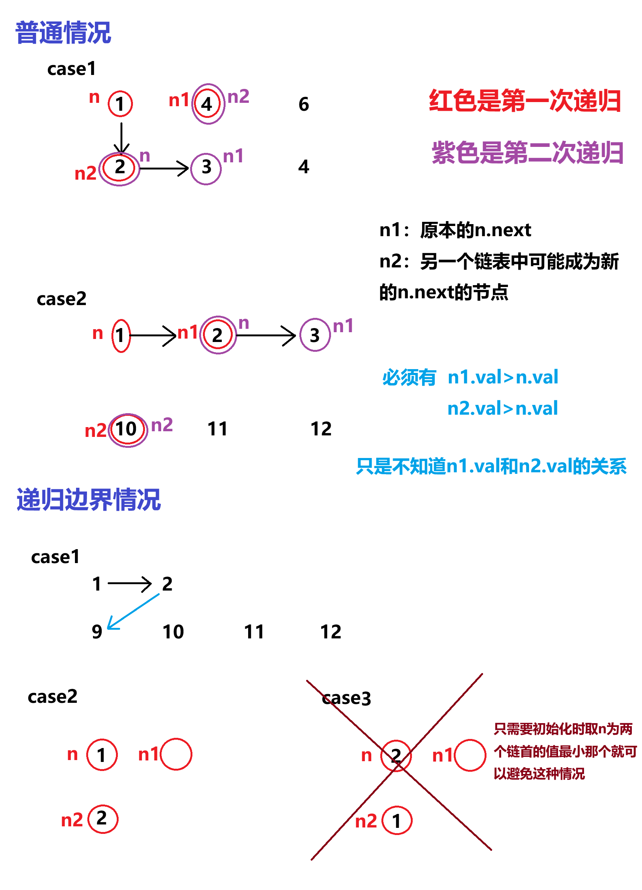

题目简述：

> 将两个升序链表合并为一个新的 **升序** 链表并返回。新链表是通过拼接给定的两个链表的所有节点组成的。 

题目链接：[21. 合并两个有序链表](https://leetcode.cn/problems/merge-two-sorted-lists/)

# 双指针迭代

## 思路

链表的双指针。

## 代码

```java
/**
 * Definition for singly-linked list.
 * public class ListNode {
 *     int val;
 *     ListNode next;
 *     ListNode() {}
 *     ListNode(int val) { this.val = val; }
 *     ListNode(int val, ListNode next) { this.val = val; this.next = next; }
 * }
 */

class Solution {
    public ListNode mergeTwoLists(ListNode list1, ListNode list2) {
        ListNode i = list1;
        ListNode j = list2;
        ListNode dummy = new ListNode();
        ListNode k = dummy;

        while (i != null && j != null) {
            if (i.val < j.val) {
                k.next = i;
                i = i.next;
                k = k.next;
                k.next = null;
            } else {
                k.next = j;
                j = j.next;
                k = k.next;
                k.next = null;
            }
        }

        if (i != null) k.next = i;
        if (j != null) k.next = j;

        return dummy.next;
    }
}
```

# 递归

## 思路

如图所示，这个图已经非常清晰明了了，请同时结合图和代码理解。



## 代码

```java
class Solution {
    public ListNode mergeTwoLists(ListNode list1, ListNode list2) {
        ListNode n, n1, n2;
        if (list1 == null) return list2;
        if (list2 == null) return list1;
        if(list1.val < list2.val) {
            n = list1;
            n1 = list1.next;
            n2 = list2;
        } else {
            n = list2;
            n1 = list2;
            n2 = list1;
        }
        
        changeNext(n, n1, n2);
        return n;
    }

    private void changeNext(ListNode n, ListNode n1, ListNode n2) {
        if (n1 == null && n2 == null) {
            return;
        } else if (n2 == null) {
            n.next = n1;
            return;
        } else if (n1 == null) {
            n.next = n2;
            return;
        }

        ListNode n3 = n1.next;
        ListNode n4 = n2.next;

        if (n2.val < n1.val) {
            n.next = n2;
            changeNext(n.next, n1, n4);
        } else {
            n.next = n1;
            changeNext(n.next, n3, n2);
        }
    }
}
```

