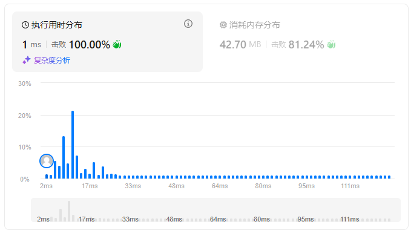

题目简述：

> 给你一个字符串表达式 `s` ，请你实现一个基本计算器来计算并返回它的值。
>
> 注意:不允许使用任何将字符串作为数学表达式计算的内置函数，比如 `eval()` 。
>
> **提示：**
>
> - `1 <= s.length <= 3 * 105`
> - `s` 由数字、`'+'`、`'-'`、`'('`、`')'`、和 `' '` 组成
> - `s` 表示一个有效的表达式
> - '+' 不能用作一元运算(例如， "+1" 和 `"+(2 + 3)"` 无效)
> - '-' 可以用作一元运算(即 "-1" 和 `"-(2 + 3)"` 是有效的)
> - 输入中不存在两个连续的操作符
> - 每个数字和运行的计算将适合于一个有符号的 32位 整数

题目链接：[224. 基本计算器](https://leetcode.cn/problems/basic-calculator/)

# 递归

## 思路

直接递归扫描不就好了吗？碰到左括号就向下进行递归调用，碰到右括号就向上返回递归调用，总有一段是不存在括号只有数字与加减的，这部分我们能够进行计算。存在括号的部分，递归调用返回值后整个括号都可以看成一个数，这个数就是递归调用返回的结果。

例如，对于 `1 - (2 + 3)`，首先扫描到括号前，记录当下结果 `1` 与下一个数字的符号 `-`，然后继续扫描，发现是左括号，进行递归调用。`2 + 3` 没有括号，因此不需要继续递归，直接向调用者返回 `2 + 3` 的结果 `5`，于是在调用者看来，表达式就不再是 `1 - (2 + 3)`，而是 `1 - 5`，对返回结果加上此前保存的 “下一个数字符号”  `-`，那么结果就是 `-4` 了。

这题真的能是 hard 吗？毕竟不存在乘除运算，只有小括号这一个优先级高于加减运算的操作，直接递归或者用栈就行了。

## 代码

给我整笑了，这题能是 hard？真的不是 easy 吗？



算法只进行了 $n$ 次元素的访问，空间上的开销只有递归栈的开销。

```java
class Solution {

    private int i;
    private int n;
    private String s;

    public int calculate(String s) {
        i = 0;
        n = s.length();
        this.s = s;

        return recursion();
    }

    private int recursion() {
        int res = 0;
        int tmp = 0;
        int sign = 1;

        while (i < n) {
            char c = s.charAt(i);

            switch (c) {
                case ' ':
                    i++;
                    break;
                case '+':
                    res += tmp * sign;
                    tmp = 0;
                    sign = 1;
                    i++;
                    break;
                case '-':
                    res += tmp * sign;
                    tmp = 0;
                    sign = -1;
                    i++;
                    break;
                case '(':
                    i++;
                    res += recursion() * sign;
                    break;
                case ')':
                    i++;
                    return res + tmp * sign;
                default:
                    tmp = tmp * 10 + (c - '0');
                    i++;
            }
        }

        return res + tmp * sign;
    }
}
```

# 双栈（迭代）

## 思路

直接照搬递归的思路，用一个栈压入此前计算的结果（<u>结果栈</u>），用另一个栈压入括号内数字的符号（<u>符号栈</u>），剩下要做的只是把递归改为迭代。

双栈法非常通用，可以解决更复杂的计算器问题。此外还有一个单栈解法，只使用一个符号栈，我认为那太局限了，对于其他问题没有太多值得借鉴的地方，所以我就不给出了。如果对单栈做法感兴趣，可以参考 [如何想到用「栈」？思路来自于递归](https://leetcode.cn/problems/basic-calculator/solutions/646800/ru-he-xiang-dao-yong-zhan-si-lu-lai-zi-y-gpca/)。

## 代码

```java
class Solution {
    public int calculate(String s) {
        int n = s.length();
        int res = 0;
        int tmp = 0;
        int sign = 1;
        Deque<Integer> num = new ArrayDeque<>();
        Deque<Integer> sgn = new ArrayDeque<>();

        for (int i = 0; i < n; i++) {
            char c = s.charAt(i);

            switch (c) {
                case ' ':
                    break;
                case '+':
                    res += tmp * sign;
                    tmp = 0;
                    sign = 1;
                    break;
                case '-':
                    res += tmp * sign;
                    tmp = 0;
                    sign = -1;
                    break;
                case '(':
                    num.push(res);
                    sgn.push(sign);
                    res = 0;
                    sign = 1;
                    break;
                case ')':
                    res = sgn.pop() * (res + tmp * sign) + num.pop();
                    tmp = 0;
                    break;
                default:
                    tmp = tmp * 10 + (c - '0');
            }
        }

        return res + tmp * sign;
    }
}
```
