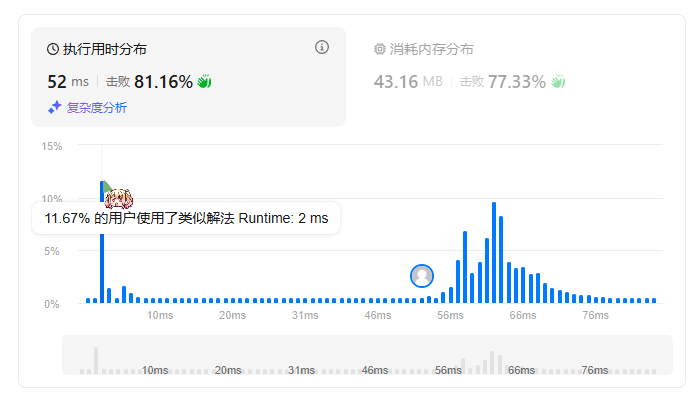
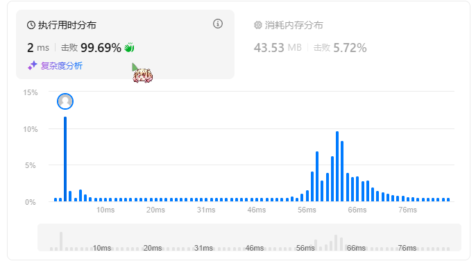

题目简述：

> 给你一个整数数组 `nums` ，找到其中最长**严格**递增子序列的长度。

题目链接：[300. 最长递增子序列](https://leetcode.cn/problems/longest-increasing-subsequence/)

# 动态规划思路

典型的一维动态规划问题。

按照通法，定义 $dp[i]$ 表示以 $\text{nums}[i]$ 结尾的最长递增子序列长度，不难推导有状态转移方程
$$
dp[i]=\left\{\begin{aligned}
&1,&&\forall j<i,\ \ \text{nums}[i]\leqslant\text{nums}[j]\\\\
&\max\Big\{dp[j]:\text{nums}[j]<\text{nums}[i],\ \ j<i\big\}+1,&&\text{Others}
\end{aligned}\right.
$$
最后 $\max dp$ 即为所求最长递增子序列的长度。

# 动态规划复杂度分析

- 时间复杂度：$O(N^2)$
- 空间复杂度：$O(N)$

# 动态规划代码

```java
class Solution {
    public int lengthOfLIS(int[] nums) {
        int[] dp = new int[nums.length];
        int maxDp = 1;
        for (int i = 0; i < nums.length; i++) {
            int temp = 1;
            boolean sign = false;
            for (int j = 0; j < i; j++) {
                if (nums[i] > nums[j]) {
                    temp = Math.max(temp, dp[j]);
                    sign = true;
                }
            }
            dp[i] = (sign) ? temp + 1 : 1;
            maxDp = Math.max(maxDp, dp[i]);
        }
        return maxDp;
    }
}
```

# 如何将时间复杂度优化至 $O(N\log N)$？

这是个一维DP问题，但是我们算法的时间复杂度却是 $O(N^2)$，这主要是因为计算 $dp[i]$ 需要用到 $dp$ 数组的条件历史最大值。虽然我们目前的性能已经较强了，但其实我们可以对时间复杂度进行进一步优化。



要让我们的算法能够跻身那前 12%，就需要将时间复杂度优化至 $O(N\log N)$ —— 优化的方案就是结合二分查找。

具体来说，我们需要维护一个 `tails`  数组，其中 `tails[i]`  表示长度为 `i+1` 的递增子序列的最小末尾元素。

- 若 `nums[i]` 大于 `tails` 的最后一个元素，将 `nums[i]` 追加到 `tails` 尾部，表示子序列长度加一；

- 否则，在 `tails` 中进行查找，找到第一个大于等于 `nums[i]` 的位置元素并用 `nums[i]` 替换该元素，使得更小的末尾元素有潜力延续递增子序列。

```java
class Solution {
    public int lengthOfLIS(int[] nums) {
        int[] tails = new int[nums.length];
        int len = 0; // 当前最长子序列长度
        
        for (int num : nums) {
            // 二分查找插入位置
            int left = 0, right = len;
            while (left < right) {
                int mid = left + (right - left) / 2;
                if (tails[mid] < num) {
                    left = mid + 1;
                } else {
                    right = mid;
                }
            }
            
            // 替换或追加元素
            tails[left] = num;
            if (left == len) {
                len++; // 子序列长度增加
            }
        }
        return len;
    }
}
```

优化后的代码在时间开销上大大滴好。

