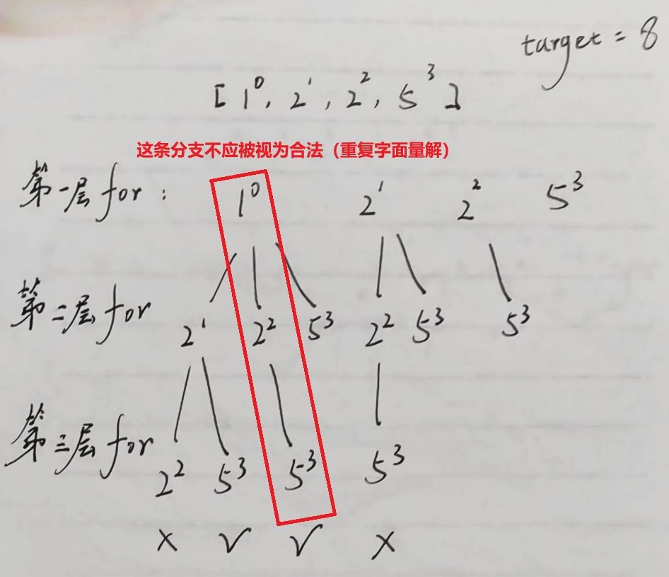

题目简述：

> 给定一个候选人编号的集合 `candidates` 和一个目标数 `target` ，找出 `candidates` 中所有可以使数字和为 `target` 的组合。
>
> `candidates` 中的每个数字在每个组合中只能使用 **一次** 。
>
> **注意：**解集不能包含重复的组合。 

题目链接：[40. 组合总和 II](https://leetcode.cn/problems/combination-sum-ii/)

# 整体思路

典型的回溯算法应用问题（全排列与组合），相比 [39. 组合总和](https://leetcode.cn/problems/combination-sum/) 每个候选人至多在每个组合中出现一次，不可重复选取。并且最终的解集中也不能包含重复的组合，这让我想到 [47. 全排列 II](https://leetcode.cn/problems/permutations-ii/)，我们可能可以通过排序巧妙而简洁地避免重复组合的结果。

```JAVA
class Solution {
    
    private int[] candidates;
    private int target;
    private List<Integer> path;
    private List<List<Integer>> res;

    public List<List<Integer>> combinationSum2(int[] candidates, int target) {
        Arrays.sort(candidates);
        this.candidates = candidates;
        this.target = target;
        this.path = new ArrayList<>();
        this.res = new ArrayList<>();
        
        dfs(-1, 0);
        return res;
    }

    /**
     * index: 上次进入 path 元素的索引
     */
    private void dfs(int index, int sum) {
        for(int i = index + 1; i < candidates.length; i++) {
            path.add(candidates[i]);
            if (sum + candidates[i] == target) {
                res.add(new ArrayList<Integer>(path));
                path.removeLast();
                return;
            } else if (sum + candidates[i] > target) {
                path.removeLast();
                return;
            }
            dfs(i, sum + candidates[i]);
            path.removeLast();
        }
    }
}
```

很容易写出来这样的回溯算法，但该算法虽然能保证不选到同一个位置的数字，却无法保证解集不包含重复的组合。例如假设 target 为 8，candidates 为 $[1^0,2^1,2^2,5^3,5^4]$，算法能正确找出解 $[1,2,5]$，但会返回字面量重复的两个解 $[1^0,2^1,5^3]$ 和 $[1^0,2^2,5^3]$。

实际上，如果允许每个数字不考虑重复地自由组合，我们应该会得到四个解：$[1^0,2^1,5^3]$、$[1^0,2^2,5^3]$、$[1^0,2^1,5^4]$ 与 $[1^0,2^2,5^4]$。这说明，我们的算法有部分去重的能力，但还不能做到完全去重。

这一部分去重的能力源自于 

```java
            if (sum + candidates[i] == target) {
                res.add(new ArrayList<Integer>(path));
                path.removeLast();
                return;
            }
```

探索到解 $[1^0,2^1,5^3]$ 后，不会继续尝试探索 $[1^0,2^1,5^4]$。

但这还不够，我们希望探索到解 $[1^0,2^1,5^3]$ 后，不要继续探索解 $[1^0,2^2,5^3]$。

# 去重的思考

仔细观察上述回溯算法的搜索树，可以发现搜索树同时具有水平结构与垂直结构。为简化表示，以 candidates 为 $[1^0,2^1,2^2,5^3]$ 的情形为例，如下图所示：



可以看到，我们已经实现的部分去重实际上是去掉了不同层间的重复，但同一层的重复未能去除。找到了问题，要解决也就不困难了，只需要保证不选择具有相同父节点且位于同一层的相同字面量数字即可，即便他们是不同的数字实例。对应到图中，就是在已探索 $[1^0,2^1]$ 的情况下，视 $[1^0,2^2]$ 为非法解，不再继续探索。具体的做法是在递归调用前判断当前数字实例的字面量是否在当前父节点的分支中已被使用过，如果是则跳过。例如，我们可以在同层条件 `i <= index + 1` 的前提下将 `candidates[i]` 与 `candidates[i-1]` 进行比较，当且仅当两者不等时说明 `candidates[i]` 为该字面量的首个数字实例，这种情况下才允许尝试将 `candidates[i]` 考虑为可能的解中的元素并继续探索。

但是不同层间依然是允许选择字面量相同的不同数字实例的，对应到图中，就是在已探索 $[1^0,5^3]$ 的情况下，允许在 $[1^0,2^1]$ 分支继续探索 $[1^0,2^1,5^3]$；在探索至分支 $[1^0,2^1]$ 的情况下，也允许继续探索 $[1^0,2^1,2^2]$。但每个数字实例仍然只被允许选择至多一次，这通过算法中 `index` 的设计所保证。

# 代码实现

```java
class Solution {
    
    private int[] candidates;
    private int target;
    private List<Integer> path;
    private List<List<Integer>> res;

    public List<List<Integer>> combinationSum2(int[] candidates, int target) {
        Arrays.sort(candidates);
        this.candidates = candidates;
        this.target = target;
        this.path = new ArrayList<>();
        this.res = new ArrayList<>();
        
        dfs(-1, 0);
        return res;
    }

    /**
     * index: 上次进入 path 元素的索引
     */
    private void dfs(int index, int sum) {
        for(int i = index + 1; i < candidates.length; i++) {
            if (i <= index + 1 || candidates[i] != candidates[i - 1]) {
                path.add(candidates[i]);
                if (sum + candidates[i] == target) {
                    res.add(new ArrayList<Integer>(path));
                    path.removeLast();
                    return;
                } else if (sum + candidates[i] > target) {
                    path.removeLast();
                    return;
                }
                dfs(i, sum + candidates[i]);
                path.removeLast();
            }
        }
    }
}
```