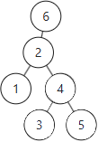

题目简述：

> 给定一个二叉搜索树的根节点 **root** 和一个值 **key**，删除二叉搜索树中的 **key** 对应的节点，并保证二叉搜索树的性质不变。返回二叉搜索树（有可能被更新）的根节点的引用。
>
> 一般来说，删除节点可分为两个步骤：
>
> 1. 首先找到需要删除的节点；
> 2. 如果找到了，删除它。
>
> 提示：
>
> - 节点值唯一，但可能不存在

题目连接：[450. 删除二叉搜索树中的节点](https://leetcode.cn/problems/delete-node-in-a-bst/)

# 思路

由于这是一棵 BST 树，因此自然想到需要考虑中序遍历。

为维护 BST 的结构，可以分情况讨论。

---

对于要删除的节点是左子节点，不妨考虑下面这个简单例子：



即

```bash
        6
       /
      2
     / \
    1   4
       / \
      3   5
```

假设我们要删除的节点为 2，

- 如果 2 是叶子节点，直接令其父节点 6 的 `left` 为 `null` 即可。
- 如果 2 的左子节点 1 不存在但右子节点 4 存在，那么直接让 4 代替 2 即可，仍符合 BST 定义。
- 如果 2 的右子节点 4 不存在但左子节点 1 存在，那么直接让 1 代替 2 即可，仍符合 BST 定义。
- 如果 2 的左右子节点均存在，由于 2 的左子树全部元素均小于右子树的全部元素，因此让左子节点 1 接到右子树的最小元素 3 的左子树上，然后再让右子节点 4 代替 2 即可，仍符合 BST 定义。

---

以上是将删除的节点为左子节点的情况。那么右子节点呢？考虑这样一棵树：

```bash
    0
     \
      2
     / \
    1   4
       / \
      3   5
```

同样假设要删除的是 2，

- 如果 2 是叶子节点，直接令其父节点 0 的 `right` 为 `null` 即可。
- 如果 2 的左子节点 1 不存在但右子节点 4 存在，那么直接让 4 代替 2 即可，仍符合 BST 定义。
- 如果 2 的右子节点 4 不存在但左子节点 1 存在，那么直接让 1 代替 2 即可，仍符合 BST 定义。
- 如果 2 的左右子节点均存在，由于 2 的左子树全部元素均小于右子树的全部元素，因此让左子节点 1 接到右子树的最小元素 3 的左子树上，然后再让右子节点 4 代替 2 即可，仍符合 BST 定义。

# 代码

我们的这个算法如果要改成迭代循环也是非常简单的，毕竟只用到了先序遍历。为什么使用先序遍历，是因为需要 `prev` 以方便修改节点。

有一种递归删除 “值动、结构不动” 的写法，和我们这样直接操纵指针字段的实现不太一样，但性能上没有什么区别。

```java
/**
 * Definition for a binary tree node.
 * public class TreeNode {
 *     int val;
 *     TreeNode left;
 *     TreeNode right;
 *     TreeNode() {}
 *     TreeNode(int val) { this.val = val; }
 *     TreeNode(int val, TreeNode left, TreeNode right) {
 *         this.val = val;
 *         this.left = left;
 *         this.right = right;
 *     }
 * }
 */

class Solution {

    TreeNode prev;
    int key;

    public TreeNode deleteNode(TreeNode root, int key) {
        TreeNode newRoot = new TreeNode(Integer.MAX_VALUE, root, null);
        prev = newRoot;
        this.key = key;
        TreeNode target =  dfs(newRoot);
        if (target == null) return root;

        TreeNode replace;
        if (target.left == null && target.right == null) {
            replace = null;
        } else if (target.right == null) {
            replace = target.left;
        } else if (target.left == null) {
            replace = target.right;
        } else {
            TreeNode deepLeft = tryLeft(target.right);
            deepLeft.left = target.left;
            replace = target.right;
        }

        if (prev.left == target) {
            prev.left = replace;
        } else {
            prev.right = replace;
        }

        return newRoot.left;
    }

    private TreeNode dfs(TreeNode node) {
        if (node.val == key) return node;

        if (node.left != null) {
            prev = node;
            TreeNode res1 = dfs(node.left);
            if (res1 != null) return res1;
        }

        if (node.right != null) {
            prev = node;
            TreeNode res2 = dfs(node.right);
            if (res2 != null) return res2;
        }

        return null;
    }

    private TreeNode tryLeft(TreeNode node) {
        while (node.left != null) {
            node = node.left;
        }
        return node;
    }
}
```

