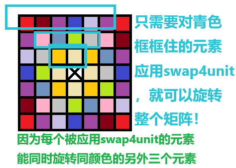

题目简述：

> 给定一个 *n* × *n* 的二维矩阵 `matrix` 表示一个图像。请你将图像顺时针旋转 90 度。
>
> 你必须在 原地 旋转图像，这意味着你需要直接修改输入的二维矩阵。**请不要** 使用另一个矩阵来旋转图像。

题目链接：[48. 旋转图像](https://leetcode.cn/problems/rotate-image/)

# 方案一、拓扑旋转

这个方案注重于每个元素的直接拓扑变换。

本方案要求读者对数字敏感，否则不太容易找准旋转中正确的行列映射及循环的边界条件，但保证仅需要一次遍历就可以实现旋转，效率极高。

## 思路

对于一个矩阵，记一个元素为A，记A顺时针旋转90度的位置上元素B，记A顺时针旋转180度的位置上元素C，记A顺时针旋转270度的位置上元素D，那么我们就不难知道，如果我们要旋转A九十度就会占用B的位置，如果我们旋转B九十度就会占用C的位置，如果我们旋转C九十度就会占用D的位置，如果我们旋转D九十度就会回到A原先的位置。也就是说，如果我们希望旋转一个元素而不产生冲突则至少要旋转一共四个元素，而且本次旋转只影响这四个元素，和矩阵内的其他任何元素均没有关系。因此，我们可以首先设计一个函数 `swap4unit`，该元素输入元素A的行列坐标，同时将A与相应B、C、D各旋转90度。实际上，对A应用 `swap4unit`，等价于对B应用 `swap4unit`，等价于对C应用 `swap4unit`，等价于对D应用 `swap4unit`，最终都使得A、B、C、D分别旋转90度（而不影响其他的任何元素）。

有了 `swap4unit` 函数，我们就可以交换矩阵中指定的元素了。现在我们还需要设计一个二重循环，以交换矩阵中的所有元素——如果我们已经对A使用了 `swap4unit`，那么我们就不应该再对B、C、D使用 `swap4unit`。一方面，这是为了尽可能减少算法的计算量，另一方面，如果对A应用了一次 `swap4unit` 但又对B再次应用 `swap4unit`，就相当于将A、B、C、D分别旋转了180度，这并不是我们希望的旋转90度结果。再者，如果对A、B、C、D分别应用一次 `swap4unit`，则相当于将A、B、C、D分别旋转360度——从结果上说这等于没有进行任何旋转。

那么该怎么确保所有元素都只被应用一次 `swap4unit` 呢？参见下图：



根据上图设计二重循环就可以了。在编写程序时应注意奇偶阶矩阵的情况，保证代码能够同时处理奇数阶矩阵和偶数阶矩阵。

## 代码

算法的时间复杂度为 $O(N^2)$，系原地算法。

```java
class Solution {
    int[][] matrix;
    int n;

    public void rotate(int[][] matrix) {
        this.matrix = matrix;
        this.n = matrix.length;

        for (int row = 0; row < n / 2; row++) {
            for (int col = row; col < n - row - 1; col++) {
                swap4unit(row, col);
            }
        }
    }

    /**
     * 一次性交换四个元素：输入第一个上半区的元素，将该元素与其对应位置的另外三个元素均顺时针旋转 90 度
     *
     * @param row 交换起始元素的行，对 row 小于 n / 2 的元素遍历应用该函数即可旋转整个矩阵
     * @param col 交换起始元素的列，对 col 小于 n - row - 1 的元素遍历应用该函数即可旋转整个矩阵
     */
    public void swap4unit(int row, int col) {
        int temp1 = matrix[col][n - row - 1];
        matrix[col][n - row - 1] = matrix[row][col];

        int temp2 = matrix[n - row - 1][n - col - 1];
        matrix[n - row - 1][n - col - 1] = temp1;

        temp1 = matrix[n - col - 1][row];
        matrix[n - col - 1][row] = temp2;

        matrix[row][col] = temp1;
    }

    // 这是一个测试用函数，按矩阵的表示法打印二维数组
    public void printMatrix() {
        for (int[] ints : matrix) {
            for (int anInt : ints) {
                System.out.print(anInt + "\t");
            }
            System.out.println();
        }
    }
}
```

# 方案二、利用矩阵转置

这个方案注重于整个矩阵的代数变换。

本方案不需要分析、处理旋转元素的行列映射以及寻找二重循环的边界条件，但是需要两次遍历才能实现旋转，尽管就时间复杂度而言与方案一均为 $O(N^2)$，空间复杂度均为 $O(1)$，但本方案时间开销常数更大。

## 思路

矩阵的转置互换矩阵的行列，原第 $i$ 行第 $j$ 列元素变为新矩阵的第 $j$ 行第 $i$ 列。我们在《线性代数》（或《高等代数》、《矩阵论》）课堂上往往更关注转置的代数性质，如果我们只考虑几何直观，那么***矩阵的转置其实就是相当于沿主对角线镜像翻转***——这意味着对方阵而言***相当于让所有的元素都旋转了90度后再逐行逆序***。

那么我们要利用矩阵转置旋转矩阵就很容易了，首先转置一次再逐行逆序即可。对于二维数组其转置的算法需要我们自行实现，遵照“交换行列对称元素”编写程序的逻辑 `matrix[i][j] = matrix[j][i]` 就行。

## 代码

算法的时间复杂度为 $O(N^2)$，系原地算法，时间开销的常数因子更大。

```java
class Solution {
    int[][] matrix;
    int n;

    public void rotate(int[][] matrix) {
        this.matrix = matrix;
        this.n = matrix.length;
        transpose();

        for (int row = 0; row < n; row++) {
            for (int col = 0; col < n / 2; col++) {
                int temp = matrix[row][col];
                matrix[row][col] = matrix[row][n - col - 1];
                matrix[row][n - col - 1] = temp;
            }
        }
    }

    public void transpose() {
        // 只需要遍历上三角区域（如果遍历所有元素相当于转置了两次，原矩阵没有任何改变）
        for (int i = 0; i < n; i++) {
            for (int j = i + 1; j < n; j++) {
                int temp = matrix[i][j];
                matrix[i][j] = matrix[j][i];
                matrix[j][i] = temp;
            }
        }
    }
}
```

