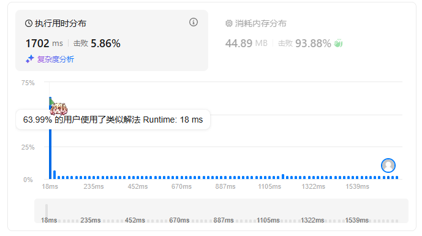

题目简述：

> 给你一个整数数组 `nums` 和一个整数 `k` ，请你统计并返回 *该数组中和为 `k` 的子数组的个数* 。
>
> 子数组是数组中元素的连续非空序列。

题目链接：[560. 和为 K 的子数组](https://leetcode.cn/problems/subarray-sum-equals-k/)

# 前缀和

我们首先计算前缀和数组，即初始化一个新数组 `prefix`，`prefix` 数组的长度应为 `nums` 数组的长度加一，稍后会说明这样做的原因。

令 `prefix[0] = 0`，`prefix[i] = prefix[i-1] + nums[i-1]`，这样就有
$$
\text{prefix}[i]=\sum^{i-1}_{j=0}\text{nums}[j]
$$
从而存在关系
$$
\text{prefix}[i]-\text{prefix}[j]=\sum^{i-1}_{k=j}\text{nums}[k]
$$
这里 $\displaystyle\sum^{i-1}_{k=j}\text{nums}[k]$ 正是一个子数组和，于是遍历 $i>j$ 并对满足子数组和为 `k` 的组合计数，最后就可以得到和为 `k` 的子数组的个数。

此前让 `prefix` 的长度为 `nums` 长度加一的理由这样 $\displaystyle\sum^{i-1}_{k=j}\text{nums}[k]$ 能够包含从 $\text{nums}[0]$ 起始的子数组，否则 $\text{prefix}[0]=\text{nums}[0]$ 将导致无论如何也会漏掉以$\text{nums}[0]$ 起始的子数组，因为 $\forall i,\ \ \text{prefix}[i]-\text{prefix}[0]$ 都不蕴含 $\text{nums}[0]$ —— $\text{nums}[0]$ 被减掉了。

按照这一逻辑设计的算法，时间复杂度为 $O(N^2)$，空间复杂度为 $O(N)$。

```java
class Solution {
    public int subarraySum(int[] nums, int k) {
        int count = 0;
        int[] prefix = new int[nums.length + 1];
        // prefix[0] = 0;

        for (int i = 1; i < prefix.length; i++) prefix[i] = prefix[i - 1] + nums[i - 1];

        for (int i = 1; i < prefix.length; i++) {
            for (int j = 0; j < i; j++) {
                if (prefix[i] - prefix[j] == k) count++;
            }
        }
        
        return count;
    }
}
```

这样的算法能够通过测试，但花费的时间实在是太多了——是力扣上大部分提交的代码的 95.5 倍。



# 结合哈希表降低时间复杂度

注意到这里我们要计算的是针对前缀和数组 `prefix` 寻找两元素的差等于目标值的情况，有没有想到力扣第一题两数之和中我们利用哈希表将时间复杂度从 $O(N^2)$ 降低到 $O(N)$ 的做法？同样地，我们这里也可以使用哈希表将时间复杂度降低至 $O(N)$。

原理是，在得到前缀和数组 `prefix` 后我们首先遍历一次 `prefix` ，将其值作为key、将索引作为value映射到一张哈希表中。由于 `prefix` 中可能存在重复值，因此value应该是一个数组，为方便使用可以向value数组顺序插入索引。

然后，我们再一次遍历前缀和数组 `prefix`。假设当前访问的 `prefix` 中的元素为 `cur`，则只需要查询哈希表中是否存在 `cur - k`，如果不存在则表明不存在以 `cur` 结尾的满足条件的子数组，否则我们应当检查key为 `cur - k` 的value数组中存储的小于 `cur` 索引的索引数量，该数量即为以 `cur` 结尾的满足条件的子数组数量。

---

按以上思路已经能够设计出时间复杂度为 $O(N)$ 的算法了，但我们可以进一步降低常数级别的时间开销和空间开销：只需要一次遍历，而且哈希表只需要存储整数，并不需要存储数组。

具体来说，我们初始化哈希表，并在稍后只遍历一次前缀和数组 `prefix`。在遍历 `prefix` 时，首先检查哈希表中是否存在 `cur - k`，如果不存在则不计数，如果存在则计数value值，然后将 `cur` 映射到哈希表中，具体而言如果不存在 `cur` key则添加key并将value设为1，否则 `cur` key的value自增一。这种情况下只需要一次遍历即可，一次遍历就实现了刚才两次遍历才完成的操作，因为此时哈希表中存储的value不是全局的索引或重复值索引次数，而是访问至 `cur` 以前的值的索引次数，通过这样时许上的关系简洁保证了不会访问到 `cur` 以后的索引。

利用哈希表，新的算法时间复杂度为 $O(N)$，空间复杂度为 $O(N)$。

```java
class Solution {
    public int subarraySum(int[] nums, int k) {
        int count = 0;
        int[] prefix = new int[nums.length + 1];
        // prefix[0] = 0;
        HashMap<Integer, Integer> map = new HashMap<>();

        for (int i = 1; i < prefix.length; i++) prefix[i] = prefix[i - 1] + nums[i - 1];

        for (int cur : prefix) {
            if (map.containsKey(cur - k)) count += map.get(cur - k);;
            map.put(cur, map.getOrDefault(cur, 0) + 1);
        }

        return count;
    }
}
```

