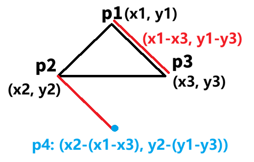

题目简述：

> 给定2D空间中四个点的坐标 `p1`, `p2`, `p3` 和 `p4`，如果这四个点构成一个正方形，则返回 `true` 。
>
> 点的坐标 `pi` 表示为 `[xi, yi]` 。 `输入没有任何顺序` 。
>
> 一个 **有效的正方形** 有四条等边和四个等角(90度角)。

题目链接：[593. 有效的正方形](https://leetcode.cn/problems/valid-square/)

# 我的思路

对于任意三个点，能够唯一确认一个三角形。我们先不考虑 `p4`，先仅考虑 `p1`、`p2` 与 `p3`，那么如果最终这四个点能作为某个正方形的顶点，则 `p1`、`p2` 与 `p3` 构成的三角形一定是一个等腰直角三角形。对于这样一个等腰直角三角形，假设 `p1` 是直角的顶点，则 `p2 - (p1 - p3)` 就是那个正方形唯一可能的顶点。



现在问题来到了：如何确认 `p1`、`p2` 与 `p3` 的确能构成一个等腰直角三角形，又如何找出其中直角的顶点是谁呢？

- 首先要解决的问题是如何判断 `p1`、`p2` 与 `p3` 是否能构成一个等腰直角三角形。有了三个点的坐标，我们就可以计算出三条边的长度，不妨分别记为 `a`、`b` 及 `c`，其中 `c` 是最大值。那么，`p1`、`p2` 与 `p3` 能构成等腰直角三角形的充要条件是：`a = b`，且 `a² + b² = c²`（勾股定理）；
- 接着要解决的是如何找出直角的顶点。由于已经证明了存在等腰直角三角形，所以可以枚举边长——只要其中两个点连成的边长不为 `a`，那么第三个点就是直角的顶点。

> 至于如何根据任意两个点的坐标计算边长……应该不必多说吧？对于 $(x_1,y_1)$ 与 $(x_2,y_2)$，其边长为 $\sqrt{(x_1-x_2)^2+(y_1-y_2)^2}$。

现在，我们可以根据三个点，计算出预期的第四个点了——假设四个点能够构成一个正方形。

> 有一个小坑是要判断一下是否有可能存在重复的点！如果是，直接返回 `false`。

# 我的代码

算法的时间复杂度与空间复杂度均为 $O(1)$。显然本问题是一个解析几何问题，而不是一个编程问题。

```java
class Solution {
    public boolean validSquare(int[] p1, int[] p2, int[] p3, int[] p4) {
        if (Arrays.equals(p1, p2) || Arrays.equals(p1, p3) || Arrays.equals(p2, p3)) return false;

        double s1 = sideLen(p1, p2);
        double s2 = sideLen(p1, p3);
        double s3 = sideLen(p2, p3);
        int[] point = null;
        int[][] others = null;

        if (isEqual(s1, s2)) {
            if (isEqual(s1 * s1 + s2 * s2, s3 * s3)) {
                point = p1;
                others = new int[][]{p2, p3};
            } else {
                return false;
            }
        } else if (isEqual(s1, s3)) {
            if (isEqual(s1 * s1 + s3 * s3, s2 * s2)) {
                point = p2;
                others = new int[][]{p1, p3};
            } else {
                return false;
            }
        } else if (isEqual(s2, s3)) {
            if (isEqual(s2 * s2 + s3 * s3, s1 * s1)) {
                point = p3;
                others = new int[][]{p1, p2};
            } else {
                return false;
            }
        } else {
            return false;
        }

        int[] pp = new int[]{
            others[0][0] + others[1][0] - point[0],
            others[0][1] + others[1][1] - point[1]
        };

        return Arrays.equals(pp, p4);
    }

    public double sideLen(int[] p1, int[] p2) {
        return Math.sqrt(((long) p1[0] - p2[0]) * (p1[0] - p2[0]) + (p1[1] - p2[1]) * (p1[1] - p2[1]));
    }

    public boolean isEqual(double d1, double d2) {
        return Math.abs(d1 - d2) < 1e-5;
    }
}
```

# 其他思路

- 旋转变换：正方形旋转九十度后，四个顶点仅仅是互换位置，不会产生新的点。在二维平面上，逆时针九十度的旋转变换为 $(x,y)\to(-y,x)$；
- 判断四点是否依次满足下面三个条件：两斜边中点相同（平行四边形）；斜边长度相同（矩形）；斜边互相垂直（正方形）。