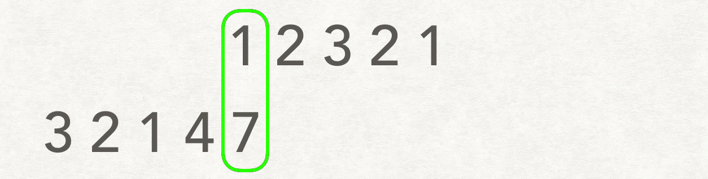
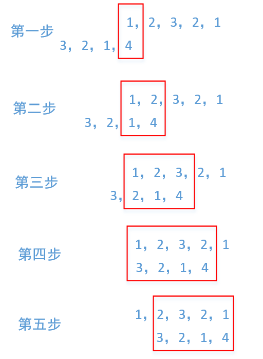

题目简述：

> 给两个整数数组 `nums1` 和 `nums2` ，返回 *两个数组中 **公共的** 、长度最长的子数组的长度* 。

题目链接：[718. 最长重复子数组](https://leetcode.cn/problems/maximum-length-of-repeated-subarray/)

# 动态规划

这个问题作为动态规划问题是很典型的。

动态规划是最容易编程的，代码编写难度几乎没有，相比之下第二种方案滑动窗口不易处理好边界条件，第三种方案字符串哈希结合二分查找更难实现，尽管他们的性能都强于动态规划。

## 思路

设 $dp[i][j]$ 表示以 `nums1[i]` 与 `nums2[j]` 结尾的最长公共子数组长度，则
$$
dp[i][j]=\left\{\begin{align}
&0,&&\text{if \ \ nums1}[i]\neq\text{nums2}[j]\\\\
&dp[i-1][j-1]+1,&&\text{if \ \ nums1}[i]=\text{nums2}[j]
\end{align}\right.
$$
为方便处理 $dp[i-1][j-1]$，额外在首行前添加哨兵行、在首列前添加哨兵列，于是设 $dp[i][j]$ 表示以 `nums1[i-1]` 与 `nums2[j-1]` 结尾的最长公共子数组长度，

Base case：
$$
dp[i][0]=dp[0][j]=0
$$
最终结果：
$$
\text{res}=\max_{i,j}dp[i][j]
$$

## 基本代码

直接按照以上分析的逻辑实现即可，时间复杂度为 $O(mn)$，空间复杂度为 $O(mn)$。

```java
class Solution {
    public int findLength(int[] nums1, int[] nums2) {
        int res = 0;
        int[][] dp = new int[nums1.length + 1][nums2.length + 1];
        // dp[i][0] = dp[0][j] = 0

        for (int i = 1; i < nums1.length + 1; i++) {
            for (int j = 1; j < nums2.length + 1; j++) {
                dp[i][j] = nums1[i - 1] == nums2[j - 1] ? dp[i - 1][j - 1] + 1 : 0;
                res = Math.max(res, dp[i][j]);
            }
        }

        return res;
    }
}
```

## 滚动数组改进

利用滚动数组减小空间开销，时间复杂度为 $O(mn)$，空间复杂度为 $O(n)$。

```java
class Solution {
    public int findLength(int[] nums1, int[] nums2) {
        int res = 0;
        int[] dpOld = new int[nums2.length + 1];
        int[] dpNew = new int[nums2.length + 1];

        for (int i = 1; i < nums1.length + 1; i++) {
            for (int j = 1; j < nums2.length + 1; j++) {
                dpNew[j] = nums1[i - 1] == nums2[j - 1] ? dpOld[j - 1] + 1 : 0;
                res = Math.max(res, dpNew[j]);
            }
            int[] tmp = dpOld;
            dpOld = dpNew;
            dpNew = tmp;
        }

        return res;
    }
}
```

# 滑动窗口

这个问题还可以用滑动窗口的办法解决。

## 思路

这里直接引用题解[滑动窗口解法](https://leetcode.cn/problems/maximum-length-of-repeated-subarray/solutions/28583/wu-li-jie-fa-by-stg-2/)中的图片，简洁直观：



也可以参考题解[java动态规划和滑动窗口解决](https://leetcode.cn/problems/maximum-length-of-repeated-subarray/solutions/310179/javadong-tai-gui-hua-jie-jue-qi-shi-jiu-shi-zui-ch/)中的示意图：



这个方法巧妙利用了***子数组必定在两个原数组中连续***的性质。具体需要注意的点见代码注释。

## 代码

滑动窗口的时间复杂度仍为 $O(mn)$，但空间复杂度为 $O(1)$。

```java
class Solution {
    int[] nums1;
    int[] nums2;

    public int findLength(int[] nums1, int[] nums2) {
        // 为方便处理，这里确保 nums1 是最长的数组
        if (nums1.length >= nums2.length) {
            this.nums1 = nums1;
            this.nums2 = nums2;
        } else {
            this.nums1 = nums2;
            this.nums2 = nums1;
        }
        int m = this.nums1.length, n = this.nums2.length, maxLength = 0;

        for (int offset = -n + 1; offset < m; offset++) {
            int start1 = Math.max(0, offset);
            int start2 = Math.max(0, -offset);
            int currentLen = Math.min(m - start1, n - start2);
            if (currentLen <= maxLength) continue;
            int currentMax = window(start1, start2, currentLen);
            maxLength = Math.max(maxLength, currentMax);
        }

        return maxLength;
    }

    /**
     * 获取滑动窗口内两个子数组的最长公共子数组长度，即示意图的红框部分
     *
     * @param n1  nums1 子数组起始索引
     * @param n2  nums2 子数组起始索引
     * @param len nums1 与 nums2 子数组的长度
     * @return 返回滑动窗口内两个子数组的最长公共子数组长度
     */
    private int window(int n1, int n2, int len) {
        int current = 0, maxLen = 0;
        for (int k = 0; k < len; k++) {
            if (nums1[n1 + k] == nums2[n2 + k]) {
                current++;
                maxLen = Math.max(maxLen, current);
            } else {
                current = 0;
            }
        }
        return maxLen;
    }
}
```

# 字符串哈希 + 二分查找

这是性能最高的方案。

## 思路

考虑 Rabin–Karp 算法编码，对两个数组上每个固定长度 $L$ 的子数组计算多项式哈希，定义索引范围 $[i,i+L)$ 上的哈希函数为
$$
H_{i,L}=(a_iB^{L-1}+a_{i+1}B^{L-2}+\cdots+a_{i+L-1}B^0)\mod{M}
$$
其中 $B$ 为所选取的基数，$M$ 为足够大的质数，例如经典的 `1_000_000_007L` 与 `1_000_000_009L`，应满足 $1<B<M$。通常 $B$ 会选择一个较大的随机数。

如果希望降低哈希碰撞的概率，可用考虑双模哈希校验，选择两对 $(B_1,M_1)$ 与 $(B_2,M_2)$，考虑两个哈希函数同时校验。

对于一个确定的 $L$，在 `nums1` 上将产生 $m-L+1$ 个哈希值，在 `nums2` 上将产生 $n-L+1$ 个哈希值。比较哈希值以快速判断是否存在重复子数组。

为了以 $O(1)$ 的时间代价实现哈希查询，构造前缀哈希数组，定义前缀索引范围 $[0,i]$ 上的哈希值为
$$
H[i]=(a_0B^i+a_1B^{i-1}+\cdots+a_iB^0)\mod{M}
$$
同时，预定义 $powB[k]=B^k\mod{M}$ 数组。那么，对于义索引范围 $[i,i+L)$ 上的哈希函数，其值为
$$
H_{i,L}=(H[i+L-1]-H[i-1]\cdot powB[L])\mod{M}
$$
事实上，应使用 1-based 编码以考虑 `nums1` 与 `nums2` 的索引 $-1$ 前缀哈希。

如果存在一个长度为 $L$ 的公共子数组，那么必然存在 $\forall L'<L$ 长度的公共子数组；如果不存在一个长度为 $L$ 的公共子数组，那么 $\forall L'>L$ 长度的公共子数组均不存在。此处存在单调性，因此可以利用二分查找算法迅速找到分界点。

## 代码

算法的时间复杂度为 $O\big((n+m)\cdot\log\min(n,m)\big)$，空间复杂度为 $O(m+n)$。


字符串哈希强的可怕。

```java
class Solution {

    private static final Random rand = new Random("Tenma Saki".hashCode());
    public static final long M1 = 1_000_000_007L;
    public static final long M2 = 1_000_000_009L;
    public static final long B1 = rand.nextLong(2, M1);
    public static final long B2 = rand.nextLong(2, M2);
    public long[] POW_B1;
    public long[] POW_B2;

    public int findLength(int[] nums1, int[] nums2) {
        int maxLen = Math.max(nums1.length, nums2.length);
        POW_B1 = new long[maxLen + 1];
        POW_B2 = new long[maxLen + 1];
        POW_B1[0] = 1;
        POW_B2[0] = 1;
        for (int i = 1; i <= maxLen; i++) {
            POW_B1[i] = mod((POW_B1[i - 1] * B1), M1);
            POW_B2[i] = mod((POW_B2[i - 1] * B2), M2);
        }

        long[] pre1_nums1 = buildPrefixHash(nums1, M1, B1);
        long[] pre2_nums1 = buildPrefixHash(nums1, M2, B2);
        long[] pre1_nums2 = buildPrefixHash(nums2, M1, B1);
        long[] pre2_nums2 = buildPrefixHash(nums2, M2, B2);

        /* 二分搜索子数组长度 L */
        int lo = 0;
        int hi = Math.min(nums1.length, nums2.length);
        while (lo <= hi) {
            int L = lo + (hi - lo) / 2;
            if (isValid(nums1, nums2, pre1_nums1, pre1_nums2, pre2_nums1, pre2_nums2, L)) {
                lo = L + 1;
            } else {
                hi = L - 1;
            }
        }

        return hi;
    }

    /* 1-based */
    public long[] buildPrefixHash(int[] nums, long M, long B) {
        long[] prefixHash = new long[nums.length + 1];

        for (int i = 1; i <= nums.length; i++) {
            prefixHash[i] = mod((prefixHash[i - 1] * B + nums[i - 1]), M);
        }

        return prefixHash;
    }

    /* 利用前缀哈希数组，查询 [i, i + L) 上子数组的哈希值 */
    public long hash(long[] prefixHash, long M, long[] powB, int i, int L) {
        return mod((prefixHash[i + L] - prefixHash[i] * powB[L]), M);
    }

    public boolean isValid(int[] nums1, int[] nums2,long[] pre1_nums1, long[] pre1_nums2, long[] pre2_nums1, long[] pre2_nums2, int L) {
        Set<Long> hash_nums1 = new HashSet<>((int) ((nums1.length - L + 1) / 0.75f) + 1);

        for (int i = 0; i <= nums1.length - L; i++) {
            long h1 = hash(pre1_nums1, M1, POW_B1, i, L);
            long h2 = hash(pre2_nums1, M2, POW_B2, i, L);
            /* 确保结果来自于同一子串，拼接 long 作为 key */
            long key = (h1 << 32) | (h2 & 0xffffffffL);
            hash_nums1.add(key);
        }

        for (int i = 0; i <= nums2.length - L; i++) {
            long h1 = hash(pre1_nums2, M1, POW_B1, i, L);
            long h2 = hash(pre2_nums2, M2, POW_B2, i, L);
            long key = (h1 << 32) | (h2 & 0xffffffffL);
            if (hash_nums1.contains(key)) return true;
        }

        return false;
    }

    private long mod(long x, long m) {
        return (x % m + m) % m;
    }

    /* 如果希望考虑到几乎不可能发生的双模哈希碰撞，则为 isValid 在返回 true 前额外进行此检查 */
    public boolean isReallyValid(int[] nums1, int[] nums2, long[] pre1_nums1, long[] pre1_nums2, long[] pre2_nums1, long[] pre2_nums2, int L) {
        if (L == 0) return true;

        Map<Long, List<Integer>> posMap = new HashMap<>();

        for (int i = 0; i <= nums1.length - L; i++) {
            long h1 = hash(pre1_nums1, M1, POW_B1, i, L);
            long h2 = hash(pre2_nums1, M2, POW_B2, i, L);
            long key = (h1 << 32) | (h2 & 0xffffffffL);
            posMap.computeIfAbsent(key, k -> new ArrayList<>()).add(i);
        }

        for (int j = 0; j <= nums2.length - L; j++) {
            long h1 = hash(pre1_nums2, M1, POW_B1, j, L);
            long h2 = hash(pre2_nums2, M2, POW_B2, j, L);
            long key = (h1 << 32) | (h2 & 0xffffffffL);

            List<Integer> starts = posMap.get(key);
            if (starts == null) continue;

            for (int i : starts) {
                boolean same = true;
                for (int k = 0; k < L; k++) {
                    if (nums1[i + k] != nums2[j + k]) {
                        same = false;
                        break;
                    }
                }
                if (same) return true;
            }
        }

        return false;
    }
}
```

