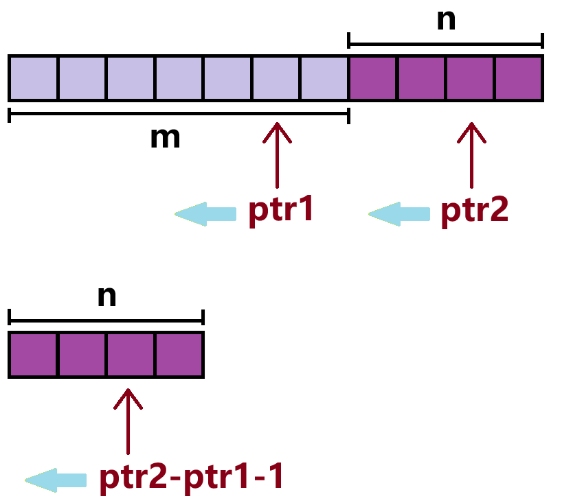

题目简述：

> 给你两个按 **非递减顺序** 排列的整数数组 `nums1` 和 `nums2`，另有两个整数 `m` 和 `n` ，分别表示 `nums1` 和 `nums2` 中的元素数目。
>
> 请你 **合并** `nums2` 到 `nums1` 中，使合并后的数组同样按 **非递减顺序** 排列。
>
> **注意：**最终，合并后数组不应由函数返回，而是存储在数组 `nums1` 中。为了应对这种情况，`nums1` 的初始长度为 `m + n`，其中前 `m` 个元素表示应合并的元素，后 `n` 个元素为 `0` ，应忽略。`nums2` 的长度为 `n` 。

题目链接：[88. 合并两个有序数组](https://leetcode.cn/problems/merge-sorted-array/)

# 思路

解决这类问题当然要使用双指针。但本题的关键在于如何有效利用两个数组的有序性实现 $O(n+m)$ 的时间复杂度以及 $O(1)$ 的空间复杂度——答案就是逆向双指针。




首先我们初始化两个 $\text{nums}1$ 上的指针 $\text{ptr}1=m-1$、$\text{ptr}2=n+m-1$，我们始终让 $\text{nums1[ptr1]}$ 与 $\text{nums}2[\text{ptr2}-\text{ptr1}-1]$ 为下一个可能的当前最大元素、让 $\text{ptr}2$ 指向下一个当前最大元素（抛开已知过去更大的元素，只讨论最大的未访问元素）应当在 $\text{nums}1$ 中被放置的位置。因此：

- 如果 $\text{nums}1[\text{ptr}1]\geqslant\text{nums}2[\text{ptr2}-\text{ptr1}-1]$，则 $\text{nums}1[\text{ptr}1]$ 为当前最大元素，将 $\text{nums}[\text{ptr}1]$ 放置于 $\text{ptr}2$ 处，$\text{ptr}1$ 与 $\text{ptr}2$ 各左移一位，即自减 $1$；
- 如果 $\text{nums}1[\text{ptr}1]<\text{nums}2[\text{ptr2}-\text{ptr1}-1]$，则 $\text{nums}2[\text{ptr2}-\text{ptr1}-1]$ 为当前最大元素，将 $\text{nums}2[\text{ptr2}-\text{ptr1}-1]$ 放置于 $\text{ptr}2$ 处，$\text{ptr}2$ 左移一位，即自减 $1$；
- 如果 $\text{ptr2}-\text{ptr1}-1<0$，意味着 $\text{nums}2$ 的所有元素均已放置到了 $\text{nuns}1$ 的空位中，终止操作。
- 如果 $\text{ptr}1<0$，意味着 $\text{nums}1$ 的所有有效元素均已被放置到了 $\text{nums}1$ 右侧的空位中，但此刻不能立即终止操作，而应当检查 $\text{ptr2}-\text{ptr1}-1$。如果 $\text{ptr2}-\text{ptr1}-1\geqslant 0$，说明 $\text{nums}2$ 还有未放置到 $\text{nuns}1$ 中的剩余元素，此时应当将 $\text{nums}2$ 剩余元素从 $\text{nums}1$ 最左侧填入，再终止操作。

高效解决该问题的关键，在于**如何操作双指针的同时利用好两数组有序的额外信息**。

该问题的另一个关键是**边界条件也需要仔细检查！`ptr1 < 0 && ptr2 - ptr1 - 1 >= 0` 很容易被忽略——至少我是报错后排查才补上的……**

# 复杂度

- 时间复杂度: $O(n+m)$
- 空间复杂度: $O(1)$

# Code
```java
class Solution {
    public void merge(int[] nums1, int m, int[] nums2, int n) {
        if (n == 0) return;
        if (m == 0) System.arraycopy(nums2, 0, nums1, 0, n);
        int ptr1 = m - 1;
        int ptr2 = n + m - 1;

        while (ptr2 - ptr1 - 1 >= 0 && ptr1 >= 0) {
            if (nums1[ptr1] >= nums2[ptr2 - ptr1 - 1]) {
                nums1[ptr2] = nums1[ptr1];
                ptr1--;
                ptr2--;
            } else {
                nums1[ptr2] = nums2[ptr2 - ptr1 - 1];
                ptr2--;
            }
        }

        if (ptr1 < 0 && ptr2 - ptr1 - 1 >= 0) System.arraycopy(nums2, 0, nums1, 0, ptr2 - ptr1);
    }
}
```

# 踩坑

我的代码是真真正正只用了两个指针，如上文中的示意图所示，$\text{nums}2$ 中的索引我是通过 $\text{ptr2}-\text{ptr1}-1$ 动态计算的，这是造成我的边界处理麻烦的一点，有点“绕来绕去”。虽然不存在性能上的劣势，但并不够直接，不利于代码的可读性和健壮性。

一个合理的实现方案，也是比较标准的做法是单独为 $\text{nums}2$ 赋予一个指针 $\text{ptr}3$，然后在维护 $\text{ptr}1$、$\text{ptr}2$ 的同时也维护 $\text{ptr}3$，而不是靠 $\text{ptr}1$ 和 $\text{ptr}2$ 动态计算。

这样就不容易陷入忽略 $\text{ptr}3$ 有效条件的误区了，代码也不需要经过缜密的分析才能开始设计、编写。

```java
class Solution {
    public void merge(int[] nums1, int m, int[] nums2, int n) {
        int ptr1 = m - 1;
        int ptr2 = n - 1;
        int ptr3 = m + n - 1;

        while (ptr1 >= 0 && ptr2 >= 0) {
            if (nums1[ptr1] > nums2[ptr2]) {
                nums1[ptr3--] = nums1[ptr1--];
            } else {
                nums1[ptr3--] = nums2[ptr2--];
            }
        }

        if (ptr2 >= 0) {
            System.arraycopy(nums2, 0, nums1, 0, ptr2 + 1);
        }
    }
}
```

这样代码就简洁、直观不少了。